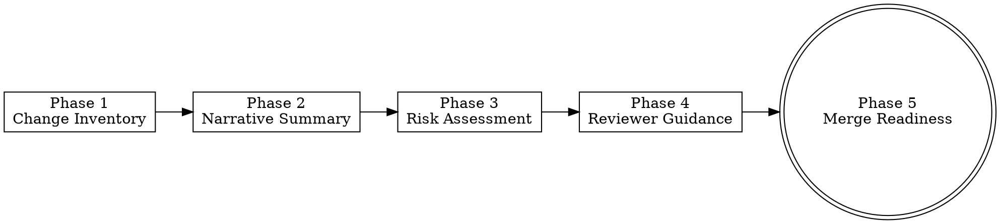

# PR Intelligence

> **Pillar**: Assure | **ID**: `assure-pr-intelligence`

## Purpose

Automated pull request analysis — generates structured summaries, risk assessments, reviewer guidance, and change impact analysis. Turns PRs from walls of diff into clear narratives.

## Activation Triggers

- "review this PR", "summarize PR", "PR summary", "pull request review"
- "what changed in this PR", "is this PR safe to merge"
- When a PR URL or branch diff is provided

## Methodology

### Process Flow



### Phase 0 — Acceptance Criteria Verification
1. Fetch the linked issue/task (via `crewpilot_board_get` or the PR description's `Closes #N`)
2. Extract the acceptance criteria checklist from the issue description
3. For each criterion, verify whether the PR's changes satisfy it:
   - **Met** — Code changes clearly implement the criterion
   - **Partially met** — Some work done but incomplete
   - **Not met** — No evidence of this criterion in the diff
4. Any **Not met** criteria are automatic blockers — the PR cannot be approved
5. Include the acceptance criteria verdict in the output:
   ```
   ### Acceptance Criteria
   - [x] Criterion 1 — Met (implemented in file.py)
   - [ ] Criterion 2 — Not met (missing from PR)
   - [~] Criterion 3 — Partially met (needs X)
   ```

### Phase 1 — Change Inventory
1. Get the diff (via git or GitHub API)
2. Categorize files changed:
   - `core` — Business logic, domain models
   - `api` — Endpoint changes, route modifications
   - `infra` — CI/CD, Dockerfiles, IaC
   - `test` — Test files
   - `config` — Configuration, env vars
   - `docs` — Documentation
3. Calculate change metrics: files changed, lines added/removed, churn
4. Identify new vs. modified vs. deleted files

### Phase 2 — Narrative Summary
Generate a human-readable summary:
1. **What**: One paragraph explaining what the PR accomplishes
2. **Why**: Inferred motivation (from commit messages, PR description, code context)
3. **How**: Key implementation decisions and patterns used

### Phase 3 — Risk Assessment
Evaluate each risk dimension:

| Dimension | Low | Medium | High |
|---|---|---|---|
| **Scope** | < 50 lines, 1-2 files | 50-200 lines, 3-5 files | > 200 lines or > 5 files |
| **Complexity** | Simple refactors | New logic paths | Algorithm/architecture changes |
| **Blast radius** | Isolated module | Shared utilities | Core framework, DB schema |
| **Test coverage** | Well-tested changes | Partial coverage | No tests for new code |
| **Reversibility** | Feature flag or easy revert | Rollback possible | DB migration, API contract |

Produce overall risk score: **Low / Medium / High / Critical**

### Phase 4 — Reviewer Guidance
1. List files to review first (highest risk → lowest)
2. Call out specific lines that need careful attention
3. Suggest questions the reviewer should ask
4. Identify what's NOT in the PR that probably should be (missing tests, missing docs, missing migration)

### Phase 5 — Merge Readiness Checklist
- [ ] Tests pass / test coverage adequate
- [ ] No security findings above medium
- [ ] Breaking changes documented
- [ ] PR description matches actual changes
- [ ] Dependencies updated safely

## Tools Required

- `githubRepo` — Fetch PR details, diff, commit history
- `codebase` — Understand impacted areas in the broader codebase
- `crewpilot_git_diff` — Get precise diff data
- `crewpilot_git_log` — Understand commit narrative

## Output Format

```
## [CrewPilot → PR Intelligence]

### Summary
**What**: {one paragraph}
**Why**: {motivation}
**How**: {key decisions}

### Change Inventory
| Category | Files | Lines (+/-) |
|---|---|---|
| core | | |
| test | | |
| ... | | |

### Risk Assessment: {Low/Medium/High/Critical}
{risk table with evaluations}

### Review Guide
**Start with**: {ordered file list}
**Pay attention to**:
- {file}:{line} — {why}
- ...

**Missing from PR**:
- {what's absent}

### Merge Readiness
{checklist with status}
```

## Chains To

- `code-quality` — Deep review of flagged files
- `vulnerability-scan` — If risk assessment flags security-adjacent changes
- `change-management` — Verify commit message quality

## References

- [security-owasp.md](../../references/security-owasp.md) — Reviewer checklist for security-touching PRs.
- [api-design.md](../../references/api-design.md) — Breaking-change risk and Hyrum's Law considerations for API-touching PRs.
- [performance.md](../../references/performance.md) — Per-PR regression budgets reviewers must call out.
- [accessibility.md](../../references/accessibility.md) — Reviewer guidance for UI-touching PRs.
- [frontend-ui.md](../../references/frontend-ui.md) — User-facing UI bar.

## Anti-Patterns

- Do NOT rubber-stamp — always identify at least one concern or question
- Do NOT summarize the diff line-by-line — synthesize into a narrative
- Do NOT skip risk assessment for "small" PRs — small and dangerous is common
- Do NOT ignore test absence — explicitly call it out

## Verification

**Evidence produced:**

- Acceptance-criteria table mapping every stated criterion to Met / Partial / Not Met with cited evidence.
- Change inventory (files, hunks, line counts) and risk assessment.
- Reviewer guidance with at least one concrete question or concern.
- Merge-readiness verdict (`READY` / `NEEDS_CHANGES` / `BLOCKED`).

**Completion gates:**

- [ ] Every acceptance criterion has a verdict and pointer to evidence.
- [ ] Risk assessment names at least one risk dimension (security, perf, regression, scope creep, ops).
- [ ] Reviewer guidance is non-empty (no rubber stamps).
- [ ] Test coverage of the diff is reported (count or percentage).

**Blocking conditions:**

- Any acceptance criterion is `Not Met` → verdict cannot be `READY`; default to `NEEDS_CHANGES`.
- Diff has no associated tests AND PR is non-trivial → flag explicitly; do not pass silently.
- Acceptance criteria missing from the issue → surface as a blocker, do not invent criteria.
