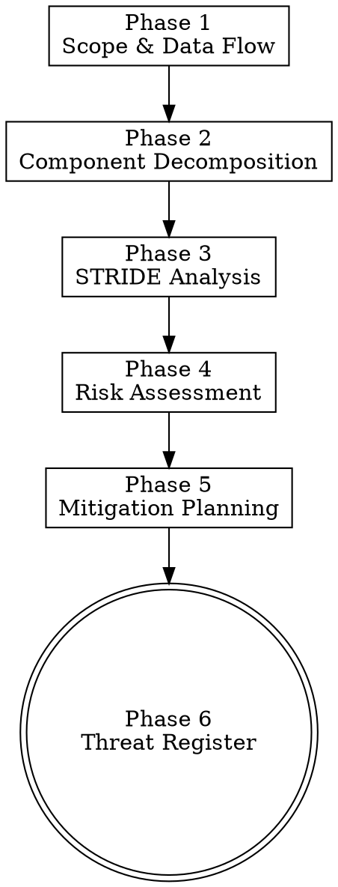

# Threat Model — STRIDE

> **Pillar**: Assure | **ID**: `assure-threat-model`

## Purpose

Systematic threat modeling using the STRIDE framework. Identifies threats across Spoofing, Tampering, Repudiation, Information Disclosure, Denial of Service, and Elevation of Privilege. Produces a threat register with risk scores and mitigations that informs design decisions and security reviews.

## Activation Triggers

- "threat model", "stride", "threat analysis", "security architecture"
- "what could go wrong", "attack vectors", "threat register"
- Label-gated: automatically invoked by autopilot-worker Phase 2.5d when `needs-threat-model` or `security-sensitive` label detected
- Routed from `security-auditor` subagent role for architecture-level security analysis

## Methodology

### Process Flow



### Phase 1 — Scope & Data Flow

1. Define the system boundary — what's being threat-modeled (entire system, single feature, or API surface)
2. Identify actors: end users, admins, external services, background jobs
3. Map data flows:
   - User input → processing → storage → output
   - Service-to-service communication
   - External API calls
4. Identify trust boundaries:
   - Authenticated vs unauthenticated zones
   - Internal vs external network
   - Client-side vs server-side
   - Different privilege levels
5. **(Optional) Fetch security context from M365**: If `mcp_workiq_ask_work_iq` is available, query for relevant compliance and security context:
   - Call `mcp_workiq_accept_eula` with `eulaUrl: "https://github.com/microsoft/work-iq-mcp"` (idempotent)
   - **Compliance requirements**: `mcp_workiq_ask_work_iq` → "What compliance requirements, security policies, or regulatory constraints apply to {system/feature}? Check emails, docs, and Teams messages."
   - **Past security discussions**: `mcp_workiq_ask_work_iq` → "What security concerns or vulnerabilities have been discussed about {system/feature} in recent emails and meetings?"
   - **Architecture decisions**: `mcp_workiq_ask_work_iq` → "What architecture or security design decisions were made about {system/feature} in meetings or design docs?"
   - Feed this context into the STRIDE analysis to ensure threats are evaluated against the organization's actual compliance posture and known security concerns.
   - If unavailable, proceed without — the threat model works from code analysis alone.

### Phase 2 — Component Decomposition

1. List each component in the data flow:
   - Frontend (SPA, mobile app, CLI)
   - API gateway / load balancer
   - Application server(s)
   - Database(s)
   - Cache layer
   - Message queue / event bus
   - External services / third-party APIs
   - File storage / CDN
2. For each component, note:
   - Technology stack
   - Authentication mechanism
   - Data stored/processed
   - Network exposure (public, internal, VPN)

### Phase 3 — STRIDE Analysis

For each component and each data flow crossing a trust boundary, evaluate all six STRIDE categories:

| Category | Threat | Key Questions |
|----------|--------|---------------|
| **S**poofing | Identity impersonation | Can an attacker pretend to be another user/service? Is authentication enforced at every entry point? Are tokens/sessions properly validated? |
| **T**ampering | Data modification | Can data be modified in transit or at rest? Are inputs validated? Is there integrity checking (HMAC, checksums)? Can request parameters be manipulated? |
| **R**epudiation | Deniability of actions | Are actions logged with sufficient detail? Can a user deny performing an action? Are audit logs tamper-proof? |
| **I**nformation Disclosure | Data exposure | Can sensitive data leak through error messages, logs, API responses, or side channels? Is PII/secrets encrypted at rest and in transit? |
| **D**enial of Service | Availability threats | Are there rate limits? Can a single request exhaust resources (memory, CPU, disk)? Are there circuit breakers? Can an attacker trigger expensive operations? |
| **E**levation of Privilege | Unauthorized access | Can a regular user access admin functions? Are authorization checks at every layer (not just frontend)? Can parameters be manipulated to bypass access controls? |

### Phase 4 — Risk Assessment

For each identified threat, assess:

1. **Likelihood** (1-5): How easy is this to exploit?
   - 1 = Requires deep insider knowledge + sophisticated tools
   - 3 = Moderately skilled attacker with publicly available tools
   - 5 = Trivial exploitation, automated scanners can find it
2. **Impact** (1-5): What's the damage if exploited?
   - 1 = Minor inconvenience, no data loss
   - 3 = Service disruption, limited data exposure
   - 5 = Full data breach, system compromise, regulatory impact
3. **Risk Score** = Likelihood × Impact (1-25)
   - 1-6: Low → Accept or monitor
   - 7-14: Medium → Mitigate within normal development
   - 15-25: High/Critical → Block release until mitigated

### Phase 5 — Mitigation Planning

For each threat with risk score ≥ 7:

1. Propose a specific mitigation (not generic "add security")
2. Classify the mitigation:
   - **Prevent**: Eliminate the threat entirely (e.g., parameterized queries for SQLi)
   - **Detect**: Monitor and alert (e.g., anomaly detection for DoS)
   - **Respond**: Limit damage (e.g., circuit breakers, rate limits)
   - **Transfer**: Shift risk (e.g., use managed service with SLA)
3. Estimate implementation effort: Low / Medium / High
4. Identify which phase of the worker pipeline should implement the mitigation:
   - Phase 4 (Implementation): Code-level fixes
   - Phase 5 (Change Mgmt): Configuration changes
   - Phase 7 (Deploy Guard): Operational checks

### Phase 6 — Threat Register

Compile all findings into a structured threat register and:
1. Store via `crewpilot_knowledge_store` (type: `threat-model`) for future reference
2. Write as artifact via `crewpilot_artifact_write` (phase: `threat-model`)
3. Feed high-risk items into the Phase 3 plan as mandatory implementation steps

## Tools Required

- `crewpilot_knowledge_store` — Store threat model for future reference
- `crewpilot_knowledge_search` — Query past threat models and security findings
- `crewpilot_artifact_write` — Persist threat register as workflow artifact
- `crewpilot_artifact_read` — Read analysis/architecture artifacts for context
- `crewpilot_metrics_complexity` — Identify complex code that may have more attack surface
- `mcp_workiq_accept_eula` — (optional) Accept Work IQ EULA before first query
- `mcp_workiq_ask_work_iq` — (optional) Query M365 for compliance requirements, security discussions, and architecture decisions

## Output Format

```
## [CrewPilot → Threat Model (STRIDE)]

### Scope
**System**: {what's being modeled}
**Actors**: {user types}
**Trust Boundaries**: {boundary list}

### Data Flow Diagram
```
{text-based data flow: Actor → Component → Data Store → Output}
```

### Threat Register

| ID | STRIDE | Component | Threat | Likelihood | Impact | Risk | Mitigation | Effort |
|----|--------|-----------|--------|------------|--------|------|------------|--------|
| T1 | S      | Auth API  | ...    | 4          | 5      | 20   | ...        | Medium |
| T2 | T      | ...       | ...    | 3          | 3      | 9    | ...        | Low    |
| ...| ...    | ...       | ...    | ...        | ...    | ...  | ...        | ...    |

### Risk Summary
- **Critical** (15-25): {count} threats → Must mitigate before release
- **Medium** (7-14): {count} threats → Mitigate within sprint
- **Low** (1-6): {count} threats → Accept/monitor

### Recommended Mitigations (Priority Order)
1. {T-ID}: {mitigation} — {effort} — Phase {N}
2. {T-ID}: {mitigation} — {effort} — Phase {N}
3. ...

### Confidence: {N}/10
```

## Chains To

- `assure-vulnerability-scan` — Complements STRIDE with OWASP/CWE code-level scanning
- `assure-review-functional` — Security pass covers code-level implementation of mitigations
- `strategize-architecture-planner` — Architecture decisions should reference the threat model
- `insights-knowledge-base` — Past threat models inform future analysis

## Anti-Patterns

- Do NOT theorize threats without a concrete component and data-flow context. Speculation without scope produces noise.
- Do NOT downgrade risk scores to keep a release moving. Likelihood × Impact is evidence-based; the verdict reflects it.
- Do NOT propose generic mitigations like "add security" or "validate inputs". Every mitigation must name the control and the layer.
- Do NOT model the entire system when scope is a single feature. Stay inside the declared boundary.
- Do NOT skip the threat register output. The artifact is the deliverable; an analysis without a register cannot be reviewed or revisited.
- Do NOT mark a threat "mitigated" without identifying which pipeline phase implements the mitigation.
- Do NOT replace STRIDE with informal brainstorming. Each component crossing a trust boundary gets all six categories evaluated.
- Do NOT include raw PII, customer names, or secret material in the threat register. Threat models become shareable artifacts; sanitize before persisting.

## Verification

**Evidence produced:**

- Threat register persisted via `crewpilot_artifact_write` (phase `threat-model`) AND `crewpilot_knowledge_store` (type `threat-model`).
- Data-flow diagram with named actors, components, and trust boundaries.
- STRIDE coverage table: every component crossing a trust boundary has all six categories evaluated.
- Risk summary with counts per band (Low / Medium / High-Critical).
- Mitigation plan with named control, layer, effort, and target pipeline phase per threat ≥ 7.

**Completion gates:**

- [ ] Scope, actors, and trust boundaries are explicitly listed.
- [ ] Every component-boundary pair has STRIDE evaluated; no "N/A" without justification.
- [ ] Every threat with risk score ≥ 7 has a mitigation row with effort and target phase.
- [ ] Threat register is sanitized (no raw PII, customer names, or secret material).
- [ ] Knowledge-base entry written with tags and timestamp.

**Blocking conditions:**

- Any threat with risk score ≥ 15 lacks a mitigation → verdict blocks release until mitigated or accepted in writing.
- Trust boundaries undefined → cannot proceed to STRIDE; restart Phase 1.
- Threat register not persisted as both artifact and knowledge entry → not complete.
