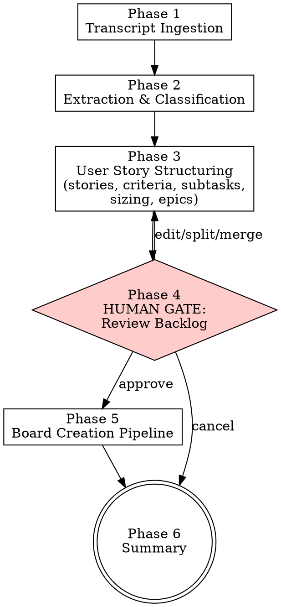

# Autopilot Meeting

> **Pillar**: Orchestrate | **ID**: `autopilot-meeting`

## Purpose

Parse a meeting transcript (standup, planning, retro, customer call) to extract work items — then create **user stories with acceptance criteria and subtasks**, group them under **epics**, and push everything to the board. Turns a 30-minute meeting into a fully structured backlog with zero manual data entry.

Specifically supports the **PM workflow**: customer meeting → epics → user stories → subtasks → sized & prioritized → sprint-ready.

## Activation Triggers

- meeting, transcript, standup, planning, retro, parse meeting, meeting notes, action items, from meeting, customer call, user stories from meeting, create stories, backlog from meeting

## Tools Required

- `crewpilot_board_create` — create issues / user stories on board
- `crewpilot_board_create_epic` — create epics to group related stories
- `crewpilot_board_create_subtask` — create subtasks linked to a parent story
- `crewpilot_board_move` — update issue status for status updates
- `crewpilot_board_comment` — log blockers and decisions on existing issues
- `crewpilot_board_assign` — assign tasks to people mentioned in transcript
- `crewpilot_knowledge_store` — store decisions, customer context, and action items
- `crewpilot_worker_start` — optionally kick off autopilot for created tasks
- `mcp_workiq_accept_eula` — (optional) accept Work IQ EULA before first query
- `mcp_workiq_ask_work_iq` — (optional, requires Work IQ extension) fetch meeting transcript and details from M365
- `crewpilot_artifact_write` — persist extracted meeting data as artifacts

## Methodology

### Process Flow



### Phase 1 — Transcript Ingestion

**Work IQ integration (zero-copy flow):** If the user specifies a meeting by name/date/subject (e.g. "parse yesterday's sprint planning" or "check my meeting discussion"):

1. **Accept EULA first**: Call `mcp_workiq_accept_eula` with `eulaUrl: "https://github.com/microsoft/work-iq-mcp"`. This is idempotent — safe to call every time.
2. **Query the meeting**: Call `mcp_workiq_ask_work_iq` with a focused question. Use targeted queries for better results:
   - "What was discussed in the {meeting name} meeting on {date}?"
   - "Summarize the transcript from my meeting with {person} on {date}"
   - "What action items came out of the {project} meeting?"
   - "What decisions were made in the {topic} meeting?"
3. If Work IQ is available, the transcript, attendees, and action items are fetched automatically — no manual paste needed.
4. **Cross-meeting context**: Query for prior decisions related to the same topic:
   - "What decisions were made about {topic} in previous meetings?"
   - "What was discussed about {feature/project} in earlier meetings this month?"
   - This surfaces continuity across meetings — ensures new items don't contradict prior agreements.
5. **Speaker identity enrichment**: Query the org chart for real names and roles:
   - "Who is {speaker name}? What is their role and team?"
   - Map speaker labels to real identities for accurate assignee attribution and RACI context.
6. **Linked document references**: Query for documents referenced or shared during the meeting:
   - "What documents, specs, or design docs were shared in the {meeting name} meeting?"
   - "Find SharePoint/OneDrive documents related to {topic} shared recently"
   - Attach linked docs to the relevant stories as context references.
7. If `mcp_workiq_ask_work_iq` is unavailable or errors, fall back to the manual flow below.

> **Data sensitivity**: Meeting transcripts may contain confidential information or PII. Do not include raw transcript excerpts with names or customer-identifying details in board items — summarize and anonymize.

Accept transcript in any format:
- Pasted text (most common)
- File path to `.vtt`, `.txt`, or `.md` file (read via tools)
- Structured notes with speaker labels

Identify:
- **Speaker labels** — look for "Name:", "Speaker 1:", timestamps with names
- **Meeting type** — standup (short updates), planning (task creation), retro (action items), **customer call** (feature requests, requirements)
- If no speaker labels, treat as unstructured notes and extract items without assignee attribution
- **Customer context** — if this is a customer/stakeholder meeting, note: who the customer is, what their role is, business justification for requests

### Phase 2 — Extraction & Classification

For each speaker turn or paragraph, classify content into:

| Type | Pattern Signals |
|---|---|
| **FEATURE_REQUEST** | "we need", "customers want", "can we add", "requirement is", "must have", "should support" |
| **USER_STORY** | "as a user", "when I", "so that", "use case", "scenario", "workflow" |
| **NEW_TASK** | "we need to", "can you", "let's build", "should implement", "create a", "add support for" |
| **STATUS_UPDATE** | "I finished", "almost done", "completed", "working on", "made progress on" |
| **BLOCKER** | "blocked on", "stuck", "waiting for", "can't proceed", "need access to", "depends on" |
| **DECISION** | "we decided", "agreed to", "let's go with", "consensus is", "chose X over Y" |
| **ACTION_ITEM** | "will do", "I'll take", "by Friday", "follow up on", name + commitment |
| **NOISE** | "can you hear me", "you're muted", greetings, filler, tangents — SKIP these |
| **BUG_REPORT** | "crashes", "broken", "doesn't work", "error", "500", "blank page", "regression", "users reporting", "intermittent", "something's wrong", "used to work", "data is wrong", "wrong result", "security issue", "vulnerability", "can't access", "slow", "performance degraded", "memory", "leak" |
| **NEEDS_DESIGN** | "figure out the approach", "evaluate options", "which technology", "trade-offs", "compare solutions", "design doc needed", "need to think through", "spike on", "investigate how", "multiple ways to" |
| **NEEDS_ARCHITECTURE** | "new system", "new module", "architecture plan", "system design", "how do components interact", "service boundary", "data flow", "new service", "infrastructure change", "cross-cutting concern" |

### Phase 3 — User Story Structuring

For each FEATURE_REQUEST, USER_STORY, or NEW_TASK, generate a **structured user story**.
For each BUG_REPORT, generate a **structured bug report** instead (see 3a-bug below).

#### 3a. User Story Format (for features/tasks)
```
Title: <concise action-oriented title, max 10 words>

As a [persona/role],
I want [capability/action],
So that [business value/outcome].
```

#### 3a-bug. Bug Report Format (for BUG_REPORT items)

Bugs are NOT user stories. They follow a different structure optimized for investigation:

```
Title: "Fix: <symptom in plain language>" (e.g., "Fix: Order history crashes for some users")

## Symptoms
- What users are seeing (exact error messages, behavior)
- When it started / how often it happens
- How many users are affected

## Reproduction Steps (extracted from transcript)
1. [Step extracted from discussion, or "Needs investigation" if not described]
2. ...

## Suspected Area
- Module/component mentioned in discussion (if any)
- Related recent changes (if mentioned)

## Severity
- P0: Security vulnerability, data loss, full outage
- P1: Feature broken for subset of users, data integrity issue
- P2: Degraded experience, workaround exists
- P3: Minor annoyance, cosmetic, performance nit
```

**Critical rule for bugs**: The first stage when a worker picks up a bug is **Root Cause Analysis (Phase 2.5c)**, NOT implementation. The task description must frame the work as "Investigate and fix" — never "Implement" or "Build". This ensures the worker runs the RCA skill (hypothesis-driven debugging) before writing any code.

**Bug severity auto-mapping** (extracted from transcript signals):
| Signal in Transcript | Severity | Label |
|---|---|---|
| "security", "vulnerability", "unauthorized", "bypass", "data exposed" | P0 | `bug`, `security` |
| "crashes", "500 error", "blank page", "data loss", "wrong totals" | P1 | `bug` |
| "slow", "degraded", "intermittent", "workaround" | P2 | `bug` |
| "annoying", "cosmetic", "minor", "eventually" | P3 | `bug` |

#### 3b. Acceptance Criteria (generate 3-5 per story)
```
## Acceptance Criteria
- [ ] Given [precondition], when [action], then [expected result]
- [ ] Given [precondition], when [action], then [expected result]
- [ ] Edge case: [scenario] is handled gracefully
- [ ] Error state: [failure mode] shows appropriate message
- [ ] Performance: [action] completes within [threshold] (if applicable)
```

#### 3c. Subtask Decomposition (generate 3-6 subtasks per story)
Break each story into implementation subtasks:
```
Subtasks:
  1. [Backend] <API/data layer work>
  2. [Frontend] <UI component work> (if applicable)
  3. [Validation] <input validation, error handling>
  4. [Tests] <unit + integration tests>
  5. [Docs] <API docs, user docs> (if applicable)
  6. [Migration] <data migration, schema changes> (if applicable)
```

#### 3d. Sizing & Priority
For each story, estimate:
- **T-shirt size**: XS (< 2h) | S (half day) | M (1-2 days) | L (3-5 days) | XL (1+ week)
- **Story points**: 1 | 2 | 3 | 5 | 8 | 13 (Fibonacci, based on complexity + uncertainty)
- **Priority**: P0 (critical/blocking) | P1 (must-have this sprint) | P2 (should-have) | P3 (nice-to-have)
- **Priority rationale**: one sentence explaining why this priority

Use these signals for priority:
- P0: "urgent", "blocking", "production issue", "customer escalation"
- P1: "important", "committed", "this sprint", "promised to customer"
- P2: "should do", "next sprint candidate", "good improvement"
- P3: "nice to have", "someday", "low impact"

#### 3e. Epic Grouping
Group related stories under an epic:
- If 3+ stories share a theme (e.g., "authentication", "dashboard", "API v2") → create an epic
- Epic title format: `[Epic] <theme name>`
- Each epic gets a high-level description summarizing the business goal
- Stories reference their parent epic via label `epic:<epic-title-slug>`

#### 3f. Dependency Detection
Identify dependencies between stories:
- "before we can do X, we need Y" → Y blocks X
- "this depends on the API being ready" → dependency noted
- Add dependency info to the Technical Notes section of the story

#### 3g. Customer Context (for customer/stakeholder meetings)
If customer context was detected in Phase 1, attach to each relevant story:
```
## Customer Context
- **Requested by**: [customer name/company]
- **Business justification**: [why they need this]
- **Commitment**: [was anything promised? timeline?]
- **Impact**: [how many users/accounts affected]
```

### Phase 4 — HUMAN GATE: Review Structured Backlog

<HARD-GATE>
Do NOT create any issues, epics, or stories on the board until the user has reviewed and approved the structured backlog.
Do NOT skip this gate even if the user says "just create everything" before seeing the structured output.
Present the full backlog first, then wait for explicit approval.
</HARD-GATE>

**STOP. Present the full structured backlog for approval:**

```
📋 Meeting → Backlog Results

Meeting type: {standup|planning|retro|customer-call}
Speakers identified: {list}
Customer: {customer name, if applicable}

━━━━━━━━━━━━━━━━━━━━━━━━━━━━━━━━━━━━━━━━
EPICS ({count}):
━━━━━━━━━━━━━━━━━━━━━━━━━━━━━━━━━━━━━━━━

📦 Epic 1: "{epic title}"
   {epic description}
   Stories: {count} | Total points: {sum}

   📝 Story 1.1: "{title}" [{T-shirt}] [{points}pts] [P{priority}]
      As a {persona}, I want {X}, so that {Y}
      Acceptance Criteria: {count} items
      Subtasks: {count} items
      Assignee: @{assignee} (or unassigned)
      Dependencies: {list or "none"}

   📝 Story 1.2: "{title}" [{T-shirt}] [{points}pts] [P{priority}]
      ...

📦 Epic 2: "{epic title}"
   ...

━━━━━━━━━━━━━━━━━━━━━━━━━━━━━━━━━━━━━━━━
STANDALONE ITEMS:
━━━━━━━━━━━━━━━━━━━━━━━━━━━━━━━━━━━━━━━━

BUG REPORTS ({count}):
  1. 🐛 [P{severity}] "{title}" — {symptom summary}
     Labels: bug{, security if applicable}
     Suspected area: {module}
     Worker flow: RCA (Phase 2.5c) → Fix → Test → PR

STATUS UPDATES ({count}):
  1. 🔄 @{person}: {task} — {update}

BLOCKERS ({count}):
  1. 🚫 @{person}: {blocker description}

DECISIONS ({count}):
  1. 💡 {decision} — agreed by: {participants}

ACTION ITEMS ({count}):
  1. ⏰ @{person}: {action} — due: {date if mentioned}

━━━━━━━━━━━━━━━━━━━━━━━━━━━━━━━━━━━━━━━━
SUMMARY:
  Epics: {N} | Stories: {N} | Bugs: {N} | Subtasks: {N}
  Total points: {N} | Avg priority: P{N}
━━━━━━━━━━━━━━━━━━━━━━━━━━━━━━━━━━━━━━━━

Options:
  [A] Approve all → create everything on board
  [E] Edit → modify specific items
  [S] Split → break a story into smaller stories
  [M] Merge → combine similar stories
  [R] Re-prioritize → change priorities
  [C] Cancel → discard
```

User can:
- **Approve all** → proceed to create everything
- **Edit** → modify specific items (change title, acceptance criteria, reassign, resize, re-prioritize, remove)
- **Split** → break a large story into smaller ones
- **Merge** → combine duplicate or overlapping stories
- **Re-prioritize** → adjust priority assignments
- **Cancel** → stop

### Phase 5 — Board Creation Pipeline

Execute in this order:

**Step 1: Create Epics**
For each epic:
1. Call `crewpilot_board_create_epic` with title, description, labels
2. Note the created epic issue ID

**Step 2: Create User Stories**
For each story:
1. Build the full description with Summary, User Story statement, Acceptance Criteria, Technical Notes, Customer Context (if applicable), Dependencies
2. Call `crewpilot_board_create` with:
   - title
   - structured description (see format below)
   - assignee
   - labels: `["user-story", "epic:<epic-slug>", "size:<t-shirt>", "priority:P{N}"]`
     - **If the story was tagged NEEDS_DESIGN in Phase 2**, add `needs-design` to labels
     - **If the story was tagged NEEDS_ARCHITECTURE in Phase 2**, add `needs-architecture` to labels
     - **If the story was tagged BUG_REPORT in Phase 2**, add `bug` to labels (and `security` if it's a security bug). Use `"bug"` instead of `"user-story"` as the first label. **This is critical** — without the `bug` label, the worker will skip RCA (Phase 2.5c) and jump straight to implementation, meaning the root cause is never properly diagnosed.
     - A story can have multiple signal labels (e.g., `bug` + `needs-design` if fixing requires design evaluation)
   - priority
   - points (Fibonacci story points)
3. Note the created story issue ID

**Story description format for board_create (features):**
```markdown
## Summary
{what and why — 2-3 sentences}

## User Story
As a {persona}, I want {capability}, so that {business value}.

## Acceptance Criteria
- [ ] Given {precondition}, when {action}, then {expected result}
- [ ] ...

## Technical Notes
- Stack: {relevant technologies}
- Dependencies: {blocking stories or external deps}
- Constraints: {performance, security, compatibility requirements}
```

**Bug description format for board_create (BUG_REPORT items):**
```markdown
## Summary
Investigate and fix: {symptom description — 1-2 sentences}

## Symptoms
- {what users are experiencing}
- {frequency / affected user count if mentioned}

## Reproduction Steps
1. {step from transcript or "Needs investigation"}
2. ...

## Suspected Area
- {module/file/component mentioned in discussion}
- {related recent changes if mentioned}

## Technical Notes
- Severity: {P0-P3 with rationale}
- Stack: {relevant technologies}
- Dependencies: {blocking issues or external deps}

## Customer Context
- Requested by: {customer} (if applicable)
- Business justification: {why}
```

**Step 3: Create Subtasks**
For each story's subtasks:
1. Call `crewpilot_board_create_subtask` with:
   - parent_id: the story's issue ID
   - title: `[Backend] Implement user authentication endpoint`
   - description: implementation details
   - labels: `["subtask", "epic:<epic-slug>"]`
2. Note created subtask IDs

**Step 4: Status Updates, Blockers, Decisions**
Same as before:
- STATUS_UPDATE → `crewpilot_board_comment` or `crewpilot_board_move`
- BLOCKER → `crewpilot_board_comment` or create blocker issue
- DECISION → `crewpilot_knowledge_store` with type: "decision"
- ACTION_ITEM → board issue or knowledge store

**Step 5: Autopilot (optional)**
If user requested autopilot → call `crewpilot_worker_start` for each created story

### Phase 6 — Summary

Present final summary:

```
✅ Meeting → Backlog Complete

Epics created:    {N} (#{ids})
Stories created:  {N} (#{ids})
Subtasks created: {N} (#{ids})
Total points:     {N}
Updated:          {N} existing items
Blockers:         {N} logged
Decisions:        {N} stored in knowledge base
Autopilot:        {N} workflows started (if any)

Board: Use crewpilot_board_view to see the full board

Dependency chain:
  Story #{X} → blocks → Story #{Y}
  Story #{Z} → blocks → Story #{W}
```

## Output Format

Use the structured formats shown in each phase. Group by epic → story → subtask. Always show counts and point totals.

## Anti-Patterns

- Do NOT create issues without showing them to the user first (Phase 4 gate is mandatory)
- Do NOT guess assignees if the transcript doesn't mention names — leave unassigned
- Do NOT extract noise/filler as tasks
- Do NOT create duplicate issues — if the transcript mentions an existing task, UPDATE it
- Do NOT auto-start autopilot without explicit user consent
- Do NOT include meeting transcript verbatim in issue descriptions — summarize
- Do NOT create stories without acceptance criteria — every story needs at least 3 criteria
- Do NOT skip subtask decomposition — every story gets 3-6 subtasks
- Do NOT assign arbitrary story points — use complexity signals from the transcript
- Do NOT create an epic for a single story — epics need 3+ related stories (otherwise standalone)

## Chains To

- `autopilot-worker` — for stories that should be implemented automatically
- `knowledge-base` — decisions and customer context are always stored

## Verification

**Evidence produced:**

- Extraction table classifying every item by type (feature, story, task, blocker, decision, action item, bug report, needs-design, needs-architecture).
- Backlog preview shown to the user before any board write.
- Sanitization log naming what was redacted (PII, customer names, competitor mentions).
- Knowledge-base entries for every decision and customer context fact.
- Board-creation summary listing IDs of every epic, story, and subtask created.

**Completion gates:**

- [ ] Phase 4 human-review gate was executed; user explicitly approved before any board write.
- [ ] Every story/bug item has acceptance criteria, sizing, and (for bugs) reproduction steps + severity.
- [ ] Sanitization rules from `board-sanitization.instructions.md` were applied before persistence.
- [ ] Customer-facing context stored in knowledge base with tags and timestamp.

**Blocking conditions:**

- User did not approve the backlog → zero board writes.
- PII or raw customer names remain in any item destined for an external board → block until sanitized.
- Transcript missing speakers or context → emit best-effort backlog and flag uncertainty; do not invent attribution.
