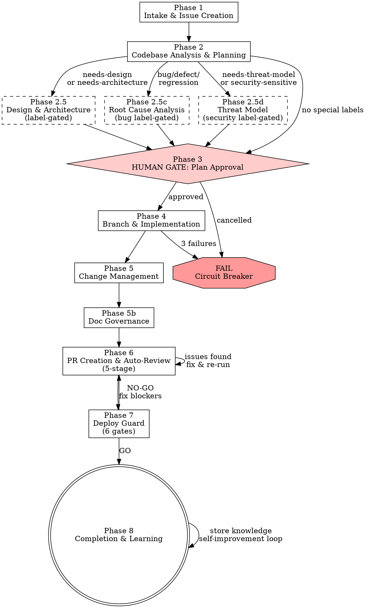

# Autopilot Worker

> **Pillar**: Orchestrate | **ID**: `autopilot-worker`

## Purpose

Single-command pipeline that creates a board issue, plans implementation, writes code + tests, applies the full Deliver pipeline (change-management → doc-governance → deploy-guard), opens a reviewed PR, and updates the board. One human gate: approve the plan. Everything else is automatic chaining through 12 skills. Includes label-gated design/architecture phases, bug-triggered root-cause analysis, and a continuous self-improvement loop via pattern detection + knowledge base.

## Activation Triggers

- autopilot, auto, pick up, work on, do this, implement and ship, end to end, full pipeline
- Routed from `feature-builder` Phase 0 when complexity is moderate or complex
- User provides a board issue number ("#42", "issue 42")

## Session Role Exception

This pipeline chains 12 skills across role boundaries (e.g. code-quality and vulnerability-scan in Phase 6 are Review skills, but run inside the Builder pipeline). **All skills invoked internally by this pipeline are unrestricted by the session role.** Role scoping only applies to user-initiated requests, not pipeline steps.

## Tools Required

- `crewpilot_board_connect` — connect to board provider (GitHub, Azure Boards, or Jira)
- `crewpilot_board_create` — create issue on board
- `crewpilot_board_move` — update issue status
- `crewpilot_board_comment` — log progress on the issue
- `crewpilot_worker_start` — start orchestrator workflow
- `crewpilot_worker_plan` — set execution plan
- `crewpilot_worker_approve` — human approval gate
- `crewpilot_worker_branch` — create feature branch
- `crewpilot_worker_pr` — push + open PR
- `crewpilot_worker_review_done` — record review verdict
- `crewpilot_worker_complete` — mark workflow done
- `crewpilot_worker_fail` — circuit breaker on failure
- `crewpilot_git_stage` — stage files
- `crewpilot_git_commit` — commit changes
- `crewpilot_exec` — run commands (tests, lint, build)
- `crewpilot_knowledge_store` — store decisions made during implementation
- `crewpilot_git_diff` — analyze changes for change-management
- `crewpilot_git_log` — commit history for release notes
- `crewpilot_metrics_coverage` — coverage check for deploy-guard
- `crewpilot_metrics_complexity` — complexity check for deploy-guard and pattern detection
- `crewpilot_worker_preview_pr` — preview changes before PR creation
- `crewpilot_worker_push_fixes` — push fixes to existing PR branch (no new PR)
- `crewpilot_board_pr_comments` — fetch review comments from a PR
- `crewpilot_knowledge_search` — query known patterns, anti-patterns, and past root causes
- `crewpilot_artifact_write` — persist phase outputs (analysis, plans, reviews) so downstream phases can read them
- `crewpilot_artifact_read` — read artifacts from prior phases (e.g. analysis → plan, plan → implementation)
- `crewpilot_artifact_list` — list all artifacts for the current workflow
- `crewpilot_dispatch_subagent` — delegate focused work (code review, test writing, security audit) to specialized sub-agents
- `crewpilot_session_save` — save session state for long-running tasks (enables resume across conversations)
- `crewpilot_session_restore` — restore a previously saved session to continue work
- `crewpilot_session_list` — list all saved sessions
- `mcp_workiq_ask_work_iq` — (optional, requires Work IQ extension) fetch M365 context (emails, docs, meetings) related to the task

## Methodology

### Process Flow



### Phase 1 — Intake & Issue Creation

**First interaction hint:** If this is the first interaction in the session, start with:
> 💡 *Running CrewPilot Autopilot — I'll summarize the task, confirm with you before creating a board issue, plan the work, get your approval, implement, test, review, and open a PR.*

**Entry mode detection** — the worker can be entered four ways:

| Entry Mode | How to Detect | Behavior |
|---|---|---|
| **Direct** | User says "autopilot", "full pipeline", etc. | Run full pipeline from Phase 1 |
| **Routed from feature-builder** | feature-builder's Phase 0 classified as moderate/complex | Skip re-analyzing complexity — it's already assessed. Use the context feature-builder gathered. |
| **Mid-build escalation** | feature-builder discovered more complexity during Phase 4 | Accept the partial context (files already touched, patterns found). Start from Phase 2 (planning) with what's already known. |
| **Session resume** | User says "resume", "continue", "pick up where I left off" | Call `crewpilot_session_restore` with the workflow ID. Read the saved state, load associated artifacts, and resume from the last pending action. |

**Session resume flow**: When resuming, the agent should:
1. Call `crewpilot_session_restore` to get the saved state
2. Call `crewpilot_artifact_list` to see what artifacts exist
3. Read relevant artifacts with `crewpilot_artifact_read`
4. **(Optional) Calendar-aware context refresh**: If `mcp_workiq_ask_work_iq` is available and significant time has passed since the session was saved (overnight, weekend, or >4 hours):
   - Call `mcp_workiq_accept_eula` with `eulaUrl: "https://github.com/microsoft/work-iq-mcp"` (idempotent)
   - **Check for new context**: `mcp_workiq_ask_work_iq` → "What meetings, emails, or Teams messages about {issue title / feature} happened since {saved_at timestamp}? Summarize any new decisions, requirement changes, or blockers."
   - **Check calendar conflicts**: `mcp_workiq_ask_work_iq` → "Do I have any meetings in the next 2 hours that might affect my availability?"
   - If new decisions or requirement changes are found, flag them to the user before continuing:
     ```
     📅 Context Update (since session was saved {age} ago):
       - {new decision / requirement change / blocker}
       → Continue with current plan? (yes / re-plan)
     ```
   - If unavailable, skip — resume proceeds without M365 context refresh.
5. Continue from the first pending action in the saved state
6. Do NOT re-run phases that have already completed (check artifacts_written)

**Complexity check (direct entry only):** If the user enters autopilot directly, quickly assess if the request warrants the full pipeline:
- If the request is trivial (single file, obvious change) → suggest: *"This is a small change. I can implement it directly without the full pipeline. Want me to do that instead?"*
- If the user says "just do it" → hand off to `feature-builder` (which will handle it as trivial/simple tier).
- Otherwise → continue with the full pipeline below.

**If user provides a task description (not an existing issue number):**

1. Parse the user's request to extract:
   - Title (concise, action-oriented)
   - Description (what needs to be built)
   - Acceptance criteria (bullet list — infer from description if not explicit)
   - Labels (feature, bug, chore — infer from context)

<HARD-GATE>
2. **HUMAN GATE — Task Creation Confirmation**: Present the inferred task summary to the user BEFORE creating the board issue:

```
📋 Before I start, here's what I'll create as a board issue:

Title: {title}
Description: {description}

Acceptance Criteria:
- [ ] {criterion 1}
- [ ] {criterion 2}
- [ ] {criterion 3}

Labels: {labels}

→ Create this task and start the pipeline? (yes / edit / no)
```

- If **yes** → call `crewpilot_board_create`, continue to Phase 2
- If **edit** → user provides corrections, update and re-present
- If **no** → stop the pipeline. Ask the user what they'd like to do instead.
- Do NOT create the board issue without explicit user confirmation.
</HARD-GATE>

3. Call `crewpilot_board_create` with title, description, acceptance criteria
4. Note the created issue ID

**If user provides an existing issue number (e.g., "#42"):**

1. Call `crewpilot_board_get` to read the existing issue
2. Use its title, description, and acceptance criteria as-is
3. No confirmation needed — the task already exists

### Phase 2 — Codebase Analysis & Planning

1. Read the project structure — scan key files (package.json, tsconfig, src/ layout, existing patterns)
2. Identify:
   - Which files need to be **created**
   - Which files need to be **modified**
   - What patterns/conventions the codebase follows (naming, directory structure, test style)
   - What dependencies might be needed
3. Check issue labels for `needs-design`, `needs-architecture`, `bug`/`defect`/`regression`, and `needs-threat-model`/`security-sensitive`
4. **Query pattern knowledge** via `crewpilot_knowledge_search` (type: `pattern`):
   - Search for known patterns and anti-patterns in the files being modified
   - Search for past root causes in the same area of the codebase
   - Collect any "repeat offender" warnings from previous runs
   - Feed this context into the plan so the worker avoids known mistakes
5. **(Optional) Fetch M365 requirements context**: First call `mcp_workiq_accept_eula` with `eulaUrl: "https://github.com/microsoft/work-iq-mcp"` (idempotent), then use **focused queries** to surface requirements context before planning:
   - **Requirements & specs**: `mcp_workiq_ask_work_iq` → "Find emails, documents, and Teams messages about: {issue title}. Summarize relevant discussions, specs, and design docs."
   - **Meeting decisions**: `mcp_workiq_ask_work_iq` → "What decisions were made about {issue title / feature name} in recent meetings? What requirements were stated?"
   - **Stakeholder expectations**: `mcp_workiq_ask_work_iq` → "What did stakeholders or customers say about {feature} in recent emails or meetings? What was promised or committed?"
   - Feed the M365 context into the analysis artifact so Phase 3's plan addresses stated requirements, not just the issue description.
   - If `mcp_workiq_ask_work_iq` is unavailable, skip — this step is optional.
6. Call `crewpilot_worker_start` with the issue ID and title
7. **Write artifact**: Call `crewpilot_artifact_write` with `workflow_id={issue_id}`, `phase="analysis"` containing:
   - Files to create/modify
   - Codebase patterns discovered
   - Dependencies needed
   - Label-gated phases to run
   - Known patterns/anti-patterns from knowledge search

### Phase 2.5 — Design & Architecture (label-gated)

**Skip this phase entirely if the issue has neither `needs-design` nor `needs-architecture` label.**

Check the issue labels (from `crewpilot_board_get`). Run the applicable skills:

#### If issue has `needs-design` label:

**Load and follow** `.github/skills/strategize-solution-design/SKILL.md`:

1. Frame the problem — restate in one sentence with constraints
2. Generate 3-4 distinct approaches with strengths, risks, and effort
3. Build a trade-off matrix comparing all options
4. Present to user:

```
📐 Design Phase for: "{issue title}"

{trade-off matrix}

Recommendation: {option} (Confidence: {N}/10)
Reversal cost: {Low/Medium/High}

→ Which approach? (A / B / C / edit)
```

5. **HUMAN GATE**: User picks an approach
6. Store the decision via `crewpilot_knowledge_store` (type: decision)
7. Write the design document to `docs/design/{issue_id}-{slug}.md`:
   ```markdown
   # Design: {issue title}
   
   **Issue**: #{id}
   **Date**: {date}
   **Decision**: {chosen option}
   
   ## Problem
   {one-sentence problem statement}
   
   ## Options Considered
   {options with strengths/risks/effort}
   
   ## Trade-off Matrix
   {matrix}
   
   ## Decision
   {chosen option with rationale}
   Confidence: {N}/10 | Reversal cost: {Low/Medium/High}
   ```
8. Stage the design doc — it will be committed alongside the code in Phase 5
9. **Write artifact**: Call `crewpilot_artifact_write` with `workflow_id={issue_id}`, `phase="design"` containing the chosen approach, trade-off summary, and design document path

#### If issue has `needs-architecture` label:

**Load and follow** `.github/skills/strategize-architecture-planner/SKILL.md`:

1. Define scope — system boundaries, actors, quality attributes
2. Decompose into components with responsibilities and interfaces
3. Trace the primary data flow through the system
4. Create an implementation roadmap with milestones
5. Present to user:

```
📐 Architecture for: "{issue title}"

Components:
| Component | Responsibility | Interface | Dependencies |
|-----------|---------------|-----------|-------------|
| ...       | ...           | ...       | ...         |

Data Flow:
1. {step} → {step} → {step}

→ Approve architecture? (yes / edit)
```

6. **HUMAN GATE**: User approves the architecture
7. Store as knowledge (type: decision)
8. Write the ADR to `docs/adr/{NNN}-{slug}.md`:
   ```markdown
   # ADR-{NNN}: {title}
   
   ## Status: Accepted
   ## Context
   {why this design was needed}
   ## Decision
   {what was decided — components, data flow, interfaces}
   ## Consequences
   {positive and negative trade-offs}
   ## Alternatives Considered
   {rejected options and why}
   ```
9. Stage the ADR — it will be committed alongside the code in Phase 5
10. **Write artifact**: Call `crewpilot_artifact_write` with `workflow_id={issue_id}`, `phase="architecture"` containing the component decomposition, data flow, interfaces, and ADR path

#### If issue has BOTH labels:

Run `needs-design` first (pick the approach), then `needs-architecture` (detail the design).  
The design decision feeds into the architecture — e.g., "we chose Redis" → architecture shows CacheService component, middleware chain, config interface.

### Phase 2.5c — Root Cause Analysis (label-gated)

**Skip if the issue does NOT have a `bug`, `defect`, or `regression` label.**

**Load and follow** `.github/skills/engineer-root-cause-analysis/SKILL.md` methodology:

1. **Symptom collection**:
   - Extract error message, stack trace, steps to reproduce from the issue description
   - Run `crewpilot_git_log` on the affected files to check recent changes
   - Query `crewpilot_knowledge_search` for previous root causes in the same area
2. **Hypothesis generation** — generate 2-3 ranked hypotheses:

```
🔍 RCA for: "{issue title}"

| # | Hypothesis | Likelihood | Evidence | Test Strategy |
|---|---|---|---|---|
| H1 | {most likely} | High | {evidence} | {how to test} |
| H2 | {alternative} | Medium | {evidence} | {how to test} |
| H3 | {edge case}  | Low   | {evidence} | {how to test} |
```

3. **Systematic elimination** — for each hypothesis (highest first):
   - Run `crewpilot_exec` to test (add logging, reproduce, check state)
   - Record result: confirmed / eliminated / narrowed
   - Max 5 attempts total (circuit breaker — same as Phase 4)
4. **Root cause identification**:
   - State in one sentence
   - Causal chain: trigger → intermediate effects → symptom
   - Design gap: WHY the code was vulnerable
5. **Feed into Phase 3 plan**:
   - The plan must fix the root cause, not just the symptom
   - Include a regression test that fails without the fix
   - Phase 5 commit footer: `Root-cause: {one-sentence description}`
6. **Store root cause** via `crewpilot_knowledge_store` (type: `root-cause`):
   - What: the root cause description
   - Where: affected files/modules
   - Why: the design gap
   - Prevention: what would have caught this earlier
7. **Write artifact**: Call `crewpilot_artifact_write` with `workflow_id={issue_id}`, `phase="rca"` containing the root cause, causal chain, design gap, prevention strategy, and affected files
8. **If root cause reveals a systemic issue**, flag it for pattern detection in Phase 6:
   - Add note: `systemic:{description}` for Phase 6 to pick up

### Phase 2.5d — Threat Modeling (label-gated)

**Skip if the issue does NOT have a `needs-threat-model` or `security-sensitive` label.**

**Load and follow** `.github/skills/assure-threat-model/SKILL.md` methodology:

1. **Read prior artifacts**: Load the `analysis` artifact (and `architecture` if it exists) to understand the system being built
2. **Scope the model**: Define the trust boundaries and data flows for the feature being implemented
3. **STRIDE analysis**: For each component and data flow crossing a trust boundary, evaluate all 6 STRIDE categories
4. **Risk assessment**: Score each threat (Likelihood × Impact = Risk)
5. **Mitigation planning**: For threats with risk ≥ 7, propose specific mitigations with effort and implementation phase
6. **Present to user**:

```
🛡️ Threat Model for: "{issue title}"

| ID | STRIDE | Component | Threat | Risk Score | Mitigation |
|----|--------|-----------|--------|------------|------------|
| T1 | ...    | ...       | ...    | ...        | ...        |

Critical threats: {count}
Required mitigations before implementation: {list}

→ Approve threat model? (yes / edit)
```

7. **HUMAN GATE**: User approves the threat model
8. Store via `crewpilot_knowledge_store` (type: `threat-model`)
9. **Write artifact**: Call `crewpilot_artifact_write` with `workflow_id={issue_id}`, `phase="threat-model"` containing the full threat register
10. Feed critical/high-risk mitigations into Phase 3 plan as mandatory implementation steps

#### After design/architecture/RCA/threat-model phases:

The design documents, RCA findings, and threat model inform the implementation plan. Phase 3's plan should reference:
- Which approach was chosen (from design doc)
- Which components to build (from architecture)
- Which interfaces to implement (from ADR)
- What root cause was found (from RCA) and what fix addresses it
- What threats were identified (from threat model) and what mitigations are required

**Read prior artifacts**: Call `crewpilot_artifact_read` to load the `analysis`, `design`, `architecture`, `rca`, and/or `threat-model` artifacts. These contain the full context from earlier phases — do not rely on chat history alone.

### Phase 3 — HUMAN GATE: Plan Approval

<HARD-GATE>
Do NOT proceed to implementation until the user has explicitly approved the plan.
Do NOT skip this gate for any reason, regardless of perceived simplicity.
If the user says "just do it" without seeing the plan, present the plan anyway.
</HARD-GATE>

**STOP HERE. Present the plan to the user:**

```
📋 Autopilot Plan for: "{issue title}"

Issue: #{id} on {board provider}
{if design doc exists: "Design: docs/design/{file}.md"}
{if ADR exists: "Architecture: docs/adr/{file}.md"}

Steps:
  1. {step description}
  2. {step description}
  ...

Files to change:
  - {path} (create/modify)
  - {path} (create/modify)

Complexity: {trivial|simple|moderate|complex}

Approve? (yes / edit / cancel)
```

- If **yes** → call `crewpilot_worker_approve`, continue to Phase 4
- If **edit** → user provides changes, update plan, re-present
- If **cancel** → call `crewpilot_worker_fail`, stop

**Write artifact**: After approval, call `crewpilot_artifact_write` with `workflow_id={issue_id}`, `phase="plan"` containing the approved plan (steps, files, complexity).

**Session checkpoint**: After plan approval, call `crewpilot_session_save` with status="checkpoint", phase="phase-3-approved", and the current context. This ensures the approved plan can be resumed if the session is interrupted.

### Phase 4 — Branch & Implementation

**Read prior artifacts**: Call `crewpilot_artifact_read` for `plan` (and `analysis`, `design`, `architecture`, `rca` if they exist) to load the full execution context.

1. Call `crewpilot_worker_branch` to create feature branch
2. Call `crewpilot_board_move` to set issue status to "in-progress"
3. **For each step in the plan:**
   a. Implement the code change (create/modify files)
   b. Follow existing codebase patterns discovered in Phase 2
   c. After each logical unit, run `crewpilot_exec("npm test")` or equivalent to verify nothing is broken
   d. If tests fail, diagnose and fix (max 3 attempts per step — circuit breaker)
4. Write tests for new code:
   - Match existing test framework and conventions
   - Cover happy path + key edge cases
   - Run tests to confirm they pass

**Circuit breaker:** If any step fails 3 times consecutively:
- Call `crewpilot_board_comment` with details of the failure
- Call `crewpilot_worker_fail` with reason
- Tell the user what went wrong and which step is stuck
- STOP. Do not continue.

### Phase 5 — Change Management (Deliver Skill #1)

**Load and follow** `.github/skills/deliver-change-management/SKILL.md` methodology:

1. Run `crewpilot_git_diff` to analyze all changes
2. Categorize changes by type: `feat`, `fix`, `refactor`, `test`, `docs`, `chore`
3. **If changes span multiple logical units** (e.g., new feature + test + config):
   - Split into separate commits with `crewpilot_git_stage` per group
   - Each commit gets its own conventional message
   - Example:
     ```
     git add src/feature.ts
     → feat(scope): add feature X (closes #ID)
     
     git add tests/feature.test.ts
     → test(scope): add tests for feature X
     
     git add docs/api.md
     → docs(scope): update API docs for feature X
     ```
4. **If changes are a single logical unit**, create one commit:
   - Format: `feat(scope): description (closes #ID)`
   - Body: what was implemented and why
   - Footer: `Closes #ID`
5. Call `crewpilot_git_stage` and `crewpilot_git_commit` for each logical commit
6. **Write artifact**: Call `crewpilot_artifact_write` with `workflow_id={issue_id}`, `phase="change-mgmt"` containing the list of commits created (hash, type, scope, message)

### Phase 5b — Doc Governance (Deliver Skill #2)

**Load and follow** `.github/skills/deliver-doc-governance/SKILL.md` methodology:

1. Check if the changes affect any **public interfaces**:
   - New/changed API endpoints
   - New/changed CLI commands
   - New/changed configuration options
   - New/changed tool signatures
   - New/changed exports or public functions
2. If public interfaces changed, run drift detection:
   - Compare README against actual project structure and features
   - Compare API docs against actual function signatures
   - Check if code examples still work
   - Verify install/setup instructions are still accurate
3. **If drift found:**
   - Fix the documentation directly (same branch)
   - Stage and commit: `docs(scope): sync docs with implementation changes`
   - Add to the PR body: `### Documentation Updated` section listing what was synced
4. **If no public interfaces changed**, skip — note "No doc changes needed" in the PR body

### Phase 6 — PR Creation & Auto-Review

1. Call `crewpilot_worker_preview_pr` with:
   - Title: primary commit message
   - Body: markdown with sections:
     - **What**: summary of changes
     - **Why**: linked to issue #{ID}
     - **Changes**: list of commits with descriptions
     - **Documentation Updated**: what docs were synced (or "N/A")
     - **How to test**: steps to verify
     - **Checklist**: tests pass, lint clean, types clean, docs synced
<HARD-GATE>
2. **HUMAN GATE**: User reviews the preview — do NOT create the PR until the user approves.
   If the user requests changes, apply them and re-preview. Never skip this gate.
</HARD-GATE>
3. Call `crewpilot_worker_pr` to create the PR
4. **Run PR Intelligence** (read `.github/skills/assure-pr-intelligence/SKILL.md`):
   - **Change inventory**: categorize changed files (core, api, test, config, docs)
   - **Risk assessment**: evaluate scope, complexity, blast radius, test coverage, reversibility → Low/Medium/High/Critical risk score
   - **Reviewer guidance**: order files by review priority, flag lines needing attention, list questions the reviewer should ask, note what's missing from the PR
   - **Merge readiness checklist**: tests pass, security clean, breaking changes documented, PR description matches changes
   - Post the full PR Intelligence report as a **comment on the PR** so the assigned reviewer sees it immediately
5. Read the diff of the PR
6. **Subagent delegation (recommended for moderate/complex changes):** Use `crewpilot_dispatch_subagent` to delegate review work in parallel:
   - Delegate `code-reviewer` role with the diff and file list — receives correctness, security, and performance findings
   - Delegate `standards-reviewer` role with the diff and codebase conventions — receives standards compliance findings
   - Delegate `security-auditor` role with source files and architecture context — receives STRIDE/OWASP findings
   - Each subagent writes its output as an artifact (e.g. `review-functional`, `review-standards`) for traceability
   - Merge subagent findings using `crewpilot_dispatch_consensus` to identify high-confidence vs disputed issues
   
   **Fallback (simple changes):** Run reviews inline without subagent delegation:
7. Run **code-quality** review internally (read `.github/skills/assure-code-quality/SKILL.md`):
   - Correctness: does the code do what the acceptance criteria say?
   - Security: any obvious vulnerabilities (SQL injection, XSS, secrets)?
   - Performance: any N+1 queries, await-in-loops, unnecessary re-renders?
   - Style: does it match codebase conventions?
7. Run **vulnerability-scan** internally (read `.github/skills/assure-vulnerability-scan/SKILL.md`):
   - OWASP Top 10 quick check on new code
   - Dependency audit: `npm audit` or `pip audit`
8. Run `crewpilot_exec("npm run lint")` and `crewpilot_exec("npm run typecheck")` if available
8b. **(Optional) Requirements alignment validation**: If M365 context was fetched in Phase 2, validate the implementation against meeting-stated requirements:
   - Read the `analysis` artifact to retrieve the M365 requirements context captured earlier
   - If the analysis artifact contains meeting decisions or stakeholder expectations, call `mcp_workiq_ask_work_iq` → "What specific requirements and acceptance criteria were stated for {feature} in meetings and emails?"
   - Cross-reference each stated requirement against the implementation diff:
     - **Covered**: the requirement is addressed by the code changes ✓
     - **Partial**: the requirement is partially addressed — flag what's missing
     - **Missing**: the requirement is not addressed at all — flag as a review finding
   - Include requirements alignment in the PR comment:
     ```
     📋 Requirements Alignment:
       Meeting requirements checked: {N}
       Covered: {count} ✓ | Partial: {count} ⚠️ | Missing: {count} ❌
       {list any partial/missing items}
     ```
   - If critical requirements are missing, flag as a review issue that must be addressed before merge
9. **Run diff-scoped pattern detection** (read `.github/skills/insights-pattern-detection/SKILL.md`):
   - Scope: only scan files changed in the diff (NOT full codebase)
   - Check for **consistency** with existing codebase patterns:
     - Error handling style matches project conventions?
     - Data access patterns match?
     - Naming conventions followed?
     - Test structure matches existing tests?
   - Check for **anti-patterns** in changed files:
     - God object/file (single file > 500 lines with mixed responsibilities)
     - Copy-paste (near-duplicate code blocks)
     - Shotgun surgery (small change touching too many files)
     - Primitive obsession (strings/numbers where domain types belong)
   - **Query knowledge base for repeat offenses**:
     - `crewpilot_knowledge_search` type: `pattern` — "has this same anti-pattern been flagged before?"
     - If a repeat offense is found, flag prominently:
       ```
       ⚠️ Recurring Pattern Issue: {description}
       Previously flagged in: {previous context}
       Suggestion: Consider a structural fix.
       ```
   - Run `crewpilot_metrics_complexity` on changed files — flag any function with complexity > threshold
   - Include pattern findings in the PR comment:
     ```
     🔎 Pattern Detection Results:
       Consistency:   {✓ follows codebase patterns | ⚠️ deviations found}
       Anti-patterns: {✓ none | ⚠️ {list}}
       Repeat issues: {✓ none | ⚠️ {count} recurring}
       Complexity:    {✓ within threshold | ⚠️ {files} above limit}
     ```
10. **If issues found (review, security, or pattern):**
   - Fix them directly
   - Re-commit: `fix(scope): address review findings`
   - Re-push
   - Re-run pattern detection on the fix to confirm resolution
11. **Write artifact**: Call `crewpilot_artifact_write` with `workflow_id={issue_id}`, `phase="review-merged"` containing the combined review results (code-quality, vulnerability-scan, pattern detection findings, and fix iterations)
12. Call `crewpilot_worker_review_done` with verdict: "approved" and summary
12. Call `crewpilot_board_move` to set issue status to "in-review"
13. Call `crewpilot_board_comment`: "PR #{pr_number} opened. Ready for review."

### Phase 7 — Deploy Guard (Deliver Skill #3)

**Load and follow** `.github/skills/deliver-deploy-guard/SKILL.md` methodology:

Before marking ready to merge, run the 6-gate checklist:

1. **Code Quality Gate**: No leftover TODOs, console.logs, or commented-out code in changed files
2. **Test Integrity Gate**: All tests pass, coverage meets threshold, no `.skip` tests
3. **Security Gate**: No hardcoded secrets, no critical CVEs, no unsafe patterns
4. **Configuration Gate**: Env vars documented, no dev config in prod paths
5. **Breaking Changes Gate**: API contracts backward-compatible, no dropped exports
6. **Operational Readiness Gate**: Health endpoints, logging, error handling

Produce a verdict and include in the PR comment:

```
🛡️ Deploy Guard Results:
  Code Quality:     ✓ pass
  Test Integrity:   ✓ pass (coverage: 86%)
  Security:         ✓ pass
  Configuration:    ✓ pass
  Breaking Changes: ✓ pass
  Operational:      ✓ pass

  Verdict: GO ✅
```

- If **GO** → proceed to Phase 8
- If **CONDITIONAL** → list warnings in PR comment, proceed (human decides)
- If **NO-GO** → fix blockers, re-run until GO or escalate to user

**Write artifact**: Call `crewpilot_artifact_write` with `workflow_id={issue_id}`, `phase="deploy-guard"` containing the full 6-gate results and verdict.

### Phase 8 — Completion & Learning

1. Call `crewpilot_board_comment` with deploy guard results: "All checks passed. Ready to merge."
2. **Store knowledge** via `crewpilot_knowledge_store`:
   - Decisions made during implementation (type: `decision`)
   - Root cause findings, if this was a bug fix (type: `root-cause`)
   - **Pattern findings** from Phase 6 (type: `pattern`):
     - What patterns were followed or violated
     - Any anti-patterns found and fixed
     - Any repeat offenses detected
     - Complexity hotspots
   - This creates the **self-improvement loop**: future runs query this data in Phase 2 to avoid repeating the same mistakes
3. Present final summary to user:

```
✅ Autopilot Complete

Issue:  #{id} — {title}
Branch: {branch_name}
PR:     #{pr_number}
Status: Ready to merge

Changes:
  - {N} commits across {M} files
  - {file} (created/modified) — {what changed}

Deliver Pipeline:
  Change Mgmt:  {N} conventional commits (feat/fix/test/docs)
  Doc Sync:     {updated | no changes needed}
  Deploy Guard: {GO | CONDITIONAL — warnings}

{if bug fix:}
Root Cause:  {one-sentence root cause}
Design Gap:  {why it was vulnerable}
Prevention:  {what would catch this earlier}

Tests:   {X} passing | Coverage: {Y}%
Review:  Auto-reviewed — code-quality + vulnerability-scan
Security: No issues found
Patterns: {✓ clean | ⚠️ {count} findings — stored for future runs}
Repeat Issues: {none | {count} recurring patterns detected}

→ Merge when ready. Board will auto-update on close.
```

4. **Write artifact**: Call `crewpilot_artifact_write` with `workflow_id={issue_id}`, `phase="completion"` containing the final summary (PR number, branch, commits, review/deploy-guard results, knowledge stored)
5. Call `crewpilot_worker_complete`

### Capability Hints (on completion)

After presenting the final summary, append **one** contextual hint based on the session. Show each hint at most once per session.

| Context | Hint |
|---|---|
| First time user ran autopilot | 💡 *I can also parse meeting transcripts into user stories and epics — say "parse meeting" with your notes.* |
| Multiple autopilot runs completed | 💡 *I can generate a daily digest summarizing all your work — say "daily digest" or "eod report".* |
| Knowledge was stored during this run | 💡 *I remember decisions across sessions. Ask "what did we decide about X" anytime to recall.* |
| Pattern issues were detected | 💡 *I can run a full codebase health scan for anti-patterns and tech debt — say "codebase health".* |

## Output Format

Always use the structured format shown in each phase. Lead with the status emoji:
- 📋 = planning
- ⚠️ = waiting for approval
- 🔨 = implementing
- 🔍 = reviewing
- ✅ = done
- ✗ = failed

## Anti-Patterns

<HARD-GATE>
- Do NOT skip the human gate (Phase 3). The plan MUST be shown and approved.
- Do NOT auto-merge the PR. Only humans merge.
- Do NOT bypass the PR preview gate (Phase 6). The user MUST see the preview.
</HARD-GATE>
- Do NOT continue after 3 consecutive failures on a step. Escalate to human.
- Do NOT install new dependencies without mentioning them in the plan.
- Do NOT modify files outside the scope of the plan without asking.
- Do NOT generate placeholder/stub code. Every file must be functional.
- Do NOT skip tests. If the project has a test framework, write tests.

## No Placeholders

Every step in the Phase 3 plan and every file produced in Phase 4 must contain real, working content. The following are **plan failures** — never write them:

| Forbidden Pattern | Why It Fails |
|---|---|
| "TBD", "TODO", "implement later" | Defers work that should be done now |
| "Add appropriate error handling" | Vague — specify which errors and how to handle them |
| "Add validation" | Which inputs? What rules? What error messages? |
| "Handle edge cases" | Name the edge cases or don't mention them |
| "Write tests for the above" | Show the actual test code |
| "Similar to Phase N" | Repeat the details — context resets between phases |
| Steps without code blocks | If a step changes code, show the code |
| References to undefined types/functions | Every symbol must trace back to an earlier step |

## Chains To

- `solution-design` — Phase 2.5: generate solution design doc when `needs-design` label detected
- `architecture-planner` — Phase 2.5: generate ADR when `needs-architecture` label detected
- `root-cause-analysis` — Phase 2.5c: systematic RCA when `bug`/`defect`/`regression` label detected
- `threat-model` — Phase 2.5d: STRIDE threat modeling when `needs-threat-model`/`security-sensitive` label detected
- `change-management` — Phase 5: proper conventional commits with multi-commit splitting
- `doc-governance` — Phase 5b: auto-detect and fix documentation drift
- `pr-intelligence` — Phase 6: risk assessment + reviewer guidance posted on PR
- `code-quality` — Phase 6: multi-pass review of the PR
- `vulnerability-scan` — Phase 6: security audit of new code
- `pattern-detection` — Phase 2 (query known patterns) + Phase 6 (diff-scoped scan) + Phase 8 (store findings)
- `deploy-guard` — Phase 7: 6-gate safety check before marking ready to merge
- `knowledge-base` — Phase 2, 2.5c, 6, 8: the memory hub that powers the self-improvement loop

## Anti-Rationalizations

| Rationalization | Rebuttal |
|---|---|
| "User clearly wants this — skip the issue-creation gate" | Clear is not the same as explicit. The gate costs one confirmation; skipping it produces unrequested board issues. |
| "Plan looks fine, skip the approval gate" | The plan is the contract. Without approval, scope creep is silent and undetectable until review. |
| "Deploy guard NO-GO is too strict for this fix" | The gate already accounts for severity. If the verdict is NO-GO, the evidence says so. Either remediate or override in writing with named owner. |
| "Phase 8 knowledge storage can wait" | The self-improvement loop only works if every workflow contributes. Skipping Phase 8 silently degrades future routing and pattern detection. |
| "Force-push to main would be the fastest fix" | Force-push to a protected branch is a separate decision, not a worker step. Refuse and surface to the user. |
| "The label-gated phase is overkill for this story" | Labels were applied for a reason. If they no longer apply, ask the user to remove them; do not skip silently. |
| "A child skill failed but the diff still looks correct" | The verdict is the truth, not the eyeball check. A child skill failure halts the phase regardless of agent intuition. |

## Verification

**Evidence produced:**

- `workflow_id` with phase artifacts persisted via `crewpilot_artifact_write` for: `analysis`, `plan`, `review`, `deploy-guard`, `completion` (and `threat-model`, `rca`, `architecture` when label-gated).
- Three human-gate decision records: issue creation, plan approval, deploy verdict.
- 12-skill invocation log showing which child skill ran in which phase.
- Knowledge-base entries written in Phase 8 (decisions, lessons, patterns).

**Completion gates:**

- [ ] All three HARD-GATEs were honored (no issue created without confirmation, no implementation without plan approval, no merge without deploy verdict).
- [ ] Every executed phase has a corresponding artifact written.
- [ ] Phase 7 deploy-guard verdict is `GO` (a `NO_GO` returns the workflow to Phase 6, not completion).
- [ ] Phase 8 stored at least one knowledge entry capturing the outcome.

**Blocking conditions:**

- Any HARD-GATE refused → workflow paused; emit current state via `crewpilot_session_save` and stop.
- A child skill returned a blocking verdict (e.g., vulnerability-scan `NOT_CLEAN`, code-quality `FAIL`) → do not advance to next phase.
- Branch protections forbid the operation (push to main, force-push) → stop and surface to the user.
