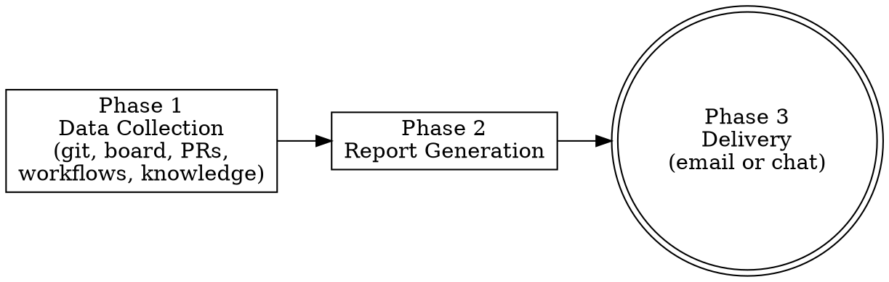

# Daily Digest

> **Pillar**: Orchestrate | **ID**: `daily-digest`

## Purpose

Generate a comprehensive daily/weekly work summary by aggregating git activity, board changes, PR status, workflow completions, and knowledge entries — then deliver it via SMTP email or display in chat. Replaces manual status reporting entirely.

## Activation Triggers

- digest, daily report, daily summary, end of day, eod report, what did I do today, status report, send update, update PM, weekly summary, send email, standup report

## Tools Required

- `crewpilot_git_log` — get commits for the time period
- `crewpilot_board_my_items` — get board items (opened, closed, in-progress)
- `crewpilot_worker_dashboard` — workflow completions and stats
- `crewpilot_knowledge_timeline` — decisions made in the period
- `crewpilot_exec` — run git/gh commands for additional data
- `crewpilot_notify_send` — deliver the report via email
- `mcp_workiq_accept_eula` — (optional) accept Work IQ EULA before first query
- `mcp_workiq_ask_work_iq` — (optional, requires Work IQ extension) fetch M365 activity (emails, meetings, docs, Teams) for a full work-surface report
- `crewpilot_artifact_write` — persist the digest as an artifact

## Methodology

### Process Flow



### Phase 1 — Data Collection

Gather from all sources for the requested time period (default: today):

**Git Activity:**
1. Call `crewpilot_git_log` with `--since="today 00:00"` (or requested range)
2. Extract: commit count, files changed, insertions/deletions, branches touched
3. Group commits by scope/type (feat, fix, refactor, test, docs)

**Board Activity:**
1. Call `crewpilot_exec` with `gh issue list --author=@me --state=all --json number,title,state,updatedAt,labels`
2. Filter to items updated in the time period
3. Categorize: created, moved to in-progress, closed/done, commented on

**PR Activity:**
1. Call `crewpilot_exec` with `gh pr list --author=@me --state=all --json number,title,state,createdAt,mergedAt,reviewDecision`
2. Filter to time period
3. Categorize: opened, merged, review pending, changes requested

**Workflow Activity:**
1. Call `crewpilot_worker_dashboard` for digital worker stats
2. Filter completed/failed workflows in the period

**Knowledge:**
1. Call `crewpilot_knowledge_timeline` for decisions and lessons stored today

**M365 Activity (optional — requires Work IQ MCP server):**
1. Call `mcp_workiq_accept_eula` with `eulaUrl: "https://github.com/microsoft/work-iq-mcp"` (idempotent — safe to call every time)
2. Use **multiple focused queries** for comprehensive coverage (targeted queries return better results than one broad question):
   - **Emails**: `mcp_workiq_ask_work_iq` → "What emails did I send and receive on {date}? Summarize key threads and any action items."
   - **Meetings**: `mcp_workiq_ask_work_iq` → "What meetings did I attend on {date}? What decisions were made and what action items were assigned to me?"
   - **Documents**: `mcp_workiq_ask_work_iq` → "What documents did I edit or view in SharePoint and OneDrive on {date}?"
   - **Teams**: `mcp_workiq_ask_work_iq` → "What Teams channel messages and chats was I active in on {date}? What mentions did I receive?"
   - **Tasks**: `mcp_workiq_ask_work_iq` → "What Planner or To-Do tasks did I complete or get assigned on {date}?"
3. If Work IQ is available, parse all responses and include the full work surface:
   - **Emails**: sent/received count, key threads, action items from emails
   - **Meetings**: attended meetings, decisions made, action items assigned, linked documents
   - **Documents**: files edited/viewed in SharePoint/OneDrive, co-authoring activity
   - **Teams**: active channel conversations, 1:1 chats, mentions, and responses
   - **Tasks**: Planner/To-Do items completed, created, or updated
4. If `mcp_workiq_ask_work_iq` is unavailable or errors, skip this section — the digest works without it (git + board + PRs is the baseline)

> **Query budget**: Work IQ queries have a ~30/session budget. The 5 queries above are a reasonable investment for a full daily digest. For weekly summaries, combine into broader date-range queries to conserve budget.

### Phase 2 — Report Generation

Compose the report in this structure:

```
📊 Daily Digest — {date} — @{username}
═══════════════════════════════════════

📝 COMMITS ({count})
  feat:     {count} — {summary of features}
  fix:      {count} — {summary of fixes}
  refactor: {count}
  test:     {count}
  other:    {count}
  
  Files changed: {N} | +{insertions} / -{deletions}

📋 BOARD ACTIVITY
  Created:     {N} items ({titles})
  In Progress: {N} items ({titles})
  Completed:   {N} items ({titles})
  Blocked:     {N} items ({titles + reason})

🔀 PULL REQUESTS
  Opened:   {N} — {PR titles with numbers}
  Merged:   {N} — {PR titles}
  Pending:  {N} — {waiting on review / changes requested}

🤖 DIGITAL WORKER
  Workflows completed: {N}
  Workflows in progress: {N}
  Workflows failed: {N}

💡 DECISIONS MADE
  - {decision 1}
  - {decision 2}

───────────────────────────────────────
Tomorrow's focus:
  - {open items in-progress}
  - {PRs waiting for review}
  - {blockers to resolve}
```

### Phase 3 — Delivery

Based on notification configuration:

**Email (default when recipients configured):**
1. Call `crewpilot_notify_send` with subject: "Daily Digest — {date} — {project name}", body: full report
2. Email sent automatically via SMTP (no manual interaction needed)
3. Requires SMTP env vars or `crewpilot_notify_configure` to be set up

**Console (fallback when no recipients configured):**
1. Just display the report in chat
2. User can copy-paste to email manually

### Phase 4 — Preview & Send

**ALWAYS preview before sending:**

```
📊 Digest Preview:

{full report}

──────────────
Send to: {recipient} via email?
(yes / edit / just show)
```

- **yes** → send via email (opens mail client with pre-filled content)
- **edit** → user modifies, re-preview
- **just show** → output only, don't send (default if no recipients configured)

## Weekly Summary Mode

When triggered with "weekly summary" or "weekly digest":

1. Aggregate across the full week (Mon-Fri)
2. Add a "Week Highlights" section at the top
3. Add trend comparison: "vs last week: +3 commits, +2 PRs, -1 blocker"
4. Include sprint velocity trend chart (text-based)

## Output Format

- Use the structured template shown in Phase 2
- Numbers first, details second
- Emoji prefixes for quick scanning
- Keep total report under 100 lines — summarize, don't enumerate every commit

## Anti-Patterns

- Do NOT send email without showing preview first
- Do NOT include sensitive data (secrets, tokens, passwords found in code)
- Do NOT fabricate activity — if nothing happened, say "quiet day"
- Do NOT include full commit messages — summarize by category
- Do NOT send to recipients not configured via crewpilot_notify_configure

## Chains To

- `knowledge-base` — the digest itself can be stored as a daily record

## Verification

**Evidence produced:**

- Digest artifact written via `crewpilot_artifact_write` (phase `digest`).
- Source-coverage table listing which sources were queried (git, board, PRs, workflows, knowledge, M365).
- Recipient list (when delivered) with delivery mode (`email` or `console`).
- Knowledge-base entry recording the digest summary.

**Completion gates:**

- [ ] Every configured source has a verdict (queried / skipped with reason / error).
- [ ] Preview was shown to the user before any email send.
- [ ] M365 query budget (≈30 per session) is reported, not silently exceeded.
- [ ] Recipients match `crewpilot_notify_configure` allow-list.

**Blocking conditions:**

- Email mode requested but SMTP is not configured → fall back to `console` mode and surface the misconfiguration.
- Recipient not in the configured allow-list → refuse to send.
- M365 enabled but EULA not accepted → prompt for `mcp_workiq_accept_eula` instead of skipping silently.
