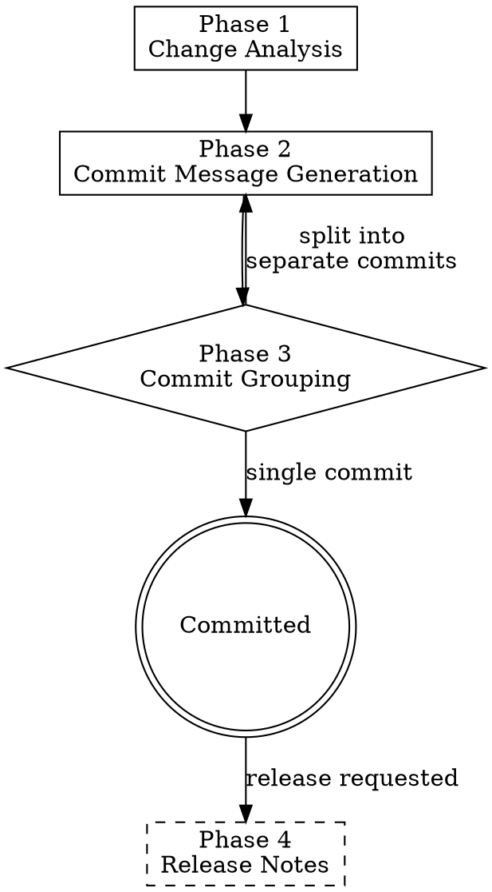

# Change Management

> **Pillar**: Deliver | **ID**: `deliver-change-management`

## Purpose

Structured commit and release workflow. Enforces conventional commits, generates changelogs, manages semantic versioning, and ensures every change is traceable.

## Activation Triggers

- "commit this", "write a commit message", "what should the commit be"
- "changelog", "release notes", "version bump"
- Automatically chained after any skill that modifies code

## Methodology

### Process Flow



### Phase 1 — Change Analysis
1. Run `git status` and `git diff --staged` to understand what's changed
2. If nothing is staged, analyze the working tree diff
3. Categorize changes:
   - **feat**: New functionality
   - **fix**: Bug fix
   - **refactor**: Code restructuring (no behavior change)
   - **test**: Adding/modifying tests
   - **docs**: Documentation only
   - **perf**: Performance improvement
   - **chore**: Build, CI, dependencies
   - **security**: Security fix

### Phase 2 — Commit Message Generation
Follow the conventional commit format configured in `commit_format`:

```
{type}({scope}): {description}

{body — what and why, not how}

{footer — breaking changes, issue references}
```

Rules:
- Subject line ≤ 72 characters
- Scope is the affected module/component (inferred from file paths)
- Body explains motivation if the change isn't obvious
- `BREAKING CHANGE:` footer for breaking changes
- Reference issues: `Closes #123`, `Fixes #456`

### Phase 3 — Commit Grouping
If multiple logical changes are staged:
1. Suggest splitting into separate commits
2. Provide the staging commands (`git add -p` guidance)
3. Generate a commit message for each logical unit

### Phase 4 — Release Notes (when requested)
1. Parse commits since last tag
2. Group by type (Features, Fixes, Breaking Changes, etc.)
3. Generate human-readable release notes
4. Suggest version bump based on commit types:
   - `BREAKING CHANGE` → major
   - `feat` → minor
   - `fix`, `perf` → patch

## Tools Required

- `terminal` — Run git commands
- `crewpilot_git_status` — Get current state
- `crewpilot_git_diff` — Get detailed diff
- `crewpilot_git_log` — Parse commit history
- `crewpilot_git_stage` — Stage files
- `crewpilot_git_commit` — Execute commit

## Output Format

```
## [CrewPilot → Change Management]

### Changes Detected
| Type | Scope | Files |
|---|---|---|
| {type} | {scope} | {file list} |

### Suggested Commit
\`\`\`
{type}({scope}): {description}

{body}

{footer}
\`\`\`

### Release Notes (if requested)
## v{X.Y.Z}
### Features
- {description} ({hash})
### Fixes
- {description} ({hash})
### Breaking Changes
- {description} ({hash})
```

## Chains To

- `doc-governance` — Check if changed code needs doc updates
- `deploy-guard` — Pre-deployment safety after committing

## Anti-Patterns

- Do NOT write generic commit messages ("update code", "fix things")
- Do NOT combine unrelated changes in one commit
- Do NOT skip the body for non-obvious changes
- Do NOT version bump without analyzing the commit history

## Verification

**Evidence produced:**

- One Conventional Commit message per logical concern (`type(scope): description` plus body and footer when needed).
- Change-type classification table (feat / fix / refactor / docs / test / chore / build / ci / perf).
- Version-bump recommendation derived from commit types since the last tag.
- Release-notes draft when a release boundary is detected.

**Completion gates:**

- [ ] Every commit message validates against the Conventional Commit grammar.
- [ ] Multi-concern diffs are split into multiple commits, not bundled.
- [ ] Body is present whenever the change is non-obvious from the subject.
- [ ] Breaking changes carry the `BREAKING CHANGE:` footer.

**Blocking conditions:**

- Diff bundles unrelated concerns → refuse to emit a single commit; split first.
- Commit message has a vague scope ("update code", "fix things") → rewrite before delivering.
- Version bump conflicts with commit history → surface the discrepancy and stop.
