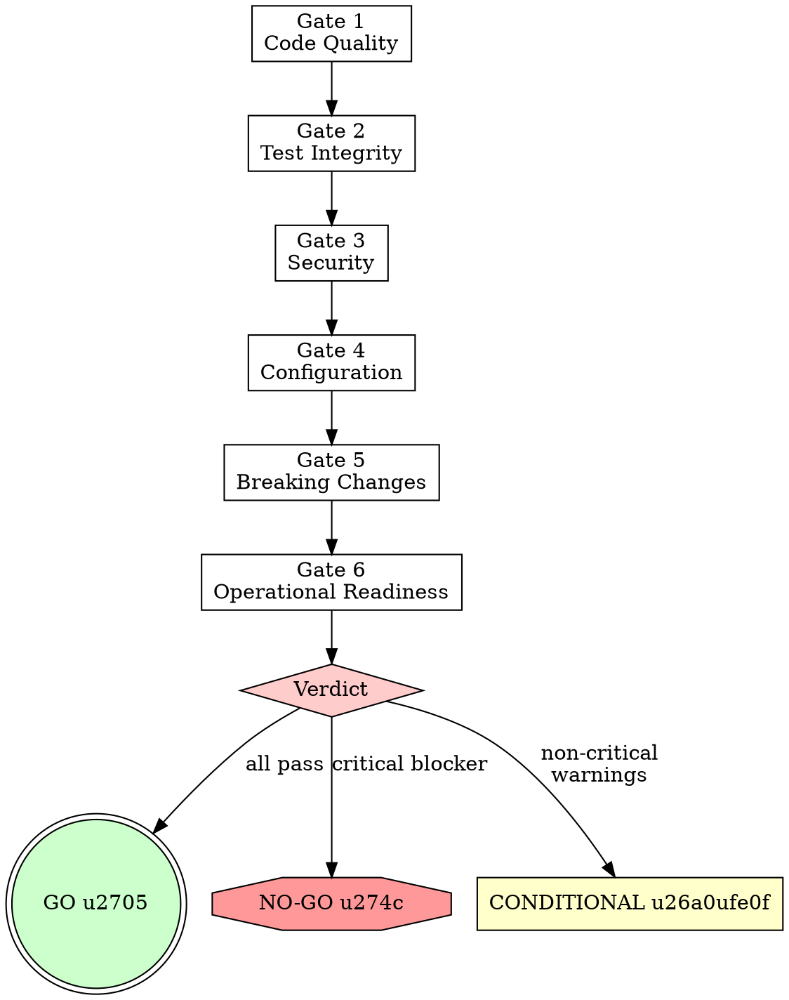

# Deploy Guard

> **Pillar**: Deliver | **ID**: `deliver-deploy-guard`

## Purpose

Pre-deployment safety validation. Runs a structured checklist of quality gates before any code ships — catches what CI/CD pipelines often miss. Acts as the last line of defense.

## Activation Triggers

- "ready to deploy?", "pre-deploy check", "can I ship this?"
- "safety check", "deploy guard", "go/no-go"
- Automatically chained after `change-management` when `phase_gates` is `strict`

## Methodology

### Process Flow



### Gate 1 — Code Quality
- [ ] All linting passes (zero errors)
- [ ] No `TODO`/`FIXME`/`HACK` in files changed since last deploy
- [ ] No `console.log`/`print`/debug statements in production paths
- [ ] No commented-out code blocks
- Run: `crewpilot_metrics_complexity` on changed files — flag any high-complexity additions

### Gate 2 — Test Integrity
- [ ] All tests pass
- [ ] Test coverage meets minimum threshold
- [ ] No skipped tests (`.skip`, `@disabled`, `@pytest.mark.skip`)
- [ ] No test files with zero assertions
- Run: `crewpilot_metrics_coverage` to validate

### Gate 3 — Security
- [ ] No new vulnerabilities from `vulnerability-scan`
- [ ] No hardcoded secrets (API keys, passwords, tokens)
- [ ] Dependencies have no critical CVEs
- [ ] No `eval()`, `exec()`, `dangerouslySetInnerHTML` without sanitization
- Run: `terminal` for `npm audit` / `pip audit` / equivalent

### Gate 4 — Configuration
- [ ] Environment variables documented and present
- [ ] No development-only configuration in production paths
- [ ] Database migrations are forward-compatible and reversible
- [ ] Feature flags set correctly for this deployment

### Gate 5 — Breaking Changes
- [ ] API contract changes are backward-compatible (or versioned)
- [ ] Database schema changes are additive (no column drops without migration)
- [ ] No removed public exports/endpoints without deprecation period
- [ ] Breaking changes documented in CHANGELOG

### Gate 6 — Operational Readiness
- [ ] Health check endpoint exists and responds
- [ ] Logging is adequate for debugging production issues
- [ ] Error handling returns appropriate HTTP status codes
- [ ] Rate limiting is configured for public endpoints

### Verdict

<HARD-GATE>
If the verdict is NO-GO, do NOT proceed with deployment, merge, or marking as ready.
All critical blockers MUST be resolved and gates re-run before proceeding.
Do NOT downgrade a NO-GO to CONDITIONAL without fixing the underlying issue.
</HARD-GATE>

Produce a clear GO / NO-GO / CONDITIONAL decision:
- **GO**: All gates pass
- **CONDITIONAL**: Non-critical issues found — list what to fix or accept
- **NO-GO**: Critical blocker found — must fix before deployment

## Tools Required

- `terminal` — Run tests, linters, audit tools
- `codebase` — Scan for anti-patterns, secrets, debug statements
- `crewpilot_metrics_coverage` — Coverage report
- `crewpilot_metrics_complexity` — Complexity scores
- `crewpilot_git_diff` — Changes since last deploy/tag

## Output Format

```
## [CrewPilot → Deploy Guard]

### Gate Results

| Gate | Status | Issues |
|---|---|---|
| Code Quality | {pass/warn/fail} | {count} |
| Test Integrity | {pass/warn/fail} | {count} |
| Security | {pass/warn/fail} | {count} |
| Configuration | {pass/warn/fail} | {count} |
| Breaking Changes | {pass/warn/fail} | {count} |
| Operational Readiness | {pass/warn/fail} | {count} |

### Blockers (if any)
{critical issues that block deployment}

### Warnings (if any)
{non-critical issues to be aware of}

### Verdict: {GO / NO-GO / CONDITIONAL}
{reasoning}
```

## Chains To

- `vulnerability-scan` — If security gate needs deeper analysis
- `change-management` — Fix and recommit if issues found
- `knowledge-base` — Record deployment decision and any exceptions made

## References

- [security-owasp.md](../../references/security-owasp.md) — Gate 1 (secrets) and Gate 6 (dependency security) thresholds.
- [performance.md](../../references/performance.md) — Gate 5 regression budgets and rolling-regression detection.
- [api-design.md](../../references/api-design.md) — Backwards-compatibility checks for API-touching deploys.
- [accessibility.md](../../references/accessibility.md) — Gate 4 anti-pattern scan for accessibility regressions.
- [frontend-ui.md](../../references/frontend-ui.md) — User-facing performance hard limits.

## Anti-Patterns

- Do NOT always say GO — be honest about risks
- Do NOT block on style issues — only on functional and security concerns
- Do NOT check gates that aren't relevant (no DB gate for a pure frontend change)
- Do NOT skip the verdict — always provide a clear decision

## Anti-Rationalizations

| Rationalization | Rebuttal |
|---|---|
| "It is an urgent fix, skip the gates" | Urgent fixes are statistically the most likely to regress. The gates exist for exactly this case. |
| "Coverage threshold does not apply to this change" | If the change is too small to test, an explicit one-line waiver is fine. If it is not, the threshold applies. |
| "The dependency CVE is theoretical for our usage" | Theoretical CVEs become incidents. Either patch, pin, or accept in writing with the exposure surface named. |
| "Performance regression is inside the noise floor" | Compounding small regressions are the dominant production-perf failure mode. Measure with a baseline or block. |
| "Secrets scan flagged a test fixture" | Test fixtures with realistic-looking credentials are still mined by attackers. Use synthetic, obviously-fake patterns. |
| "Frontend-only change — skip the dependency audit" | Frontend supply-chain attacks are the fastest-growing category. The audit runs on every change. |

## Verification

**Evidence produced:**

- Six-gate verdict table (secrets, complexity, coverage, anti-patterns, performance, dependency security) with explicit pass / fail / not-applicable per gate plus cited evidence.
- Final verdict (`GO` / `NO_GO`) with confidence.
- For `NO_GO`: a return-to-phase-6 instruction listing the failing gate(s) and required remediations.

**Completion gates:**

- [ ] Every one of the six gates has a verdict — no skipped gates without a stated reason.
- [ ] Each gate verdict cites concrete evidence (scanner output, metric value, audit summary).
- [ ] Coverage and complexity values are compared against thresholds from `crewpilot.config.json`.
- [ ] Final verdict matches the gate-table contents (no `GO` when any gate failed).

**Blocking conditions:**

- Any gate verdict is `fail` → final verdict MUST be `NO_GO`.
- A gate was skipped without justification → cannot deliver verdict; rerun.
- Secrets scan finds material in the diff → immediate `NO_GO` regardless of other gates.
