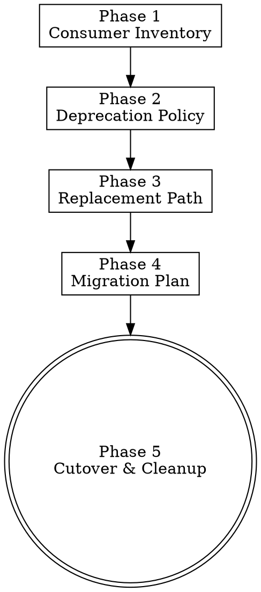

# Deprecation & Migration

> **Pillar**: Deliver | **ID**: `deliver-deprecation-migration`

## Purpose

Plan and execute the structured retirement of code, APIs, configuration, or dependencies. Treats existing code as a liability to be removed only when the consumer migration path is verified and the cutover criteria are explicit. Eliminates the most common cause of zombie code and silent breakage: half-finished deprecations where an old path lingers indefinitely alongside its replacement.

## Activation Triggers

- "deprecate this", "phase out X", "migrate from X to Y", "remove this module", "kill switch", "sunset"
- An existing API is being replaced and the old surface still has consumers.
- A library, framework, or runtime is being upgraded with breaking changes.
- An internal abstraction is being collapsed or split.

## Methodology

### Process Flow



### Phase 1 — Consumer Inventory

1. Identify the deprecated surface (file, function, class, API endpoint, config key, env var, dependency).
2. Find every consumer:
   - In-repo: `crewpilot_git_log` plus codebase grep for imports, references, dynamic dispatch, reflection.
   - Out-of-repo: search related repos, documentation, knowledge-base entries, board items.
   - Operational: log queries, telemetry, downstream service contracts.
3. Classify each consumer: `internal-tested` / `internal-untested` / `external-controlled` / `external-uncontrolled` / `unknown`.

### Phase 2 — Deprecation Policy

Choose a policy and document the choice. The four valid policies:

| Policy | When to use | Mechanic |
|--------|-------------|----------|
| **Compulsory by date** | Security or correctness-critical removals; external consumers exist | Deprecation notice with hard cutover date; warnings escalate to errors at the date |
| **Advisory** | Internal cleanup with no urgency; consumers can migrate at their pace | Deprecation warning emitted; no enforced removal date |
| **Soft removal** | Internal-only with full test coverage | Surface marked deprecated, internally inlined or replaced; external behavior preserved temporarily |
| **Hard removal** | Surface has zero remaining consumers | Direct deletion plus a single migration commit |

Forbidden: undocumented "we will get to it" deprecations. Every deprecation has an owner and a written end-state.

### Phase 3 — Replacement Path

For every consumer in the Phase 1 inventory, name the replacement:

- **Direct mapping**: old call → new call with mechanical translation (preferred).
- **Pattern shift**: old call → new pattern; provide before/after examples.
- **No replacement**: the surface is being removed without substitution; document the rationale and the consumer-side impact.

If any consumer has no viable replacement, the deprecation is BLOCKED. Either provide a replacement, downgrade the policy to advisory until one exists, or accept the breakage in writing.

### Phase 4 — Migration Plan

Produce an ordered plan with three required stages:

1. **Announce**: deprecation warning shipped with replacement guidance and (if compulsory) the cutover date. Consumers see the warning every time the surface is used.
2. **Migrate**: each consumer category converted, smallest reversible step first; tests added or updated; commits scoped to one consumer per commit when feasible.
3. **Remove**: the deprecated surface is deleted; release notes call out the removal; CI gate prevents reintroduction.

Each stage has a written exit criterion. The plan must name:

- The owner.
- The expected duration per stage.
- The signals used to confirm a stage is complete (consumer count, telemetry, test outcomes).
- The rollback path for each stage.

### Phase 5 — Cutover & Cleanup

When migration finishes:

1. Confirm zero remaining consumers via repeated Phase 1 scan.
2. Delete the deprecated surface, the deprecation warning, and any compatibility shims introduced for migration.
3. Update documentation, examples, READMEs, and the changelog (via `deliver-change-management`).
4. Remove deprecation-only tests; ensure replacement tests cover the consumer behavior.
5. Persist a knowledge entry (type `decision`, tags `deprecation`, `migration`) recording: deprecated surface, replacement, policy, duration, lessons learned.

## Tools Required

- `crewpilot_git_log` — Find original introduction and recent churn on the deprecated surface.
- `crewpilot_artifact_write` — Persist consumer inventory, policy decision, migration plan, cutover summary.
- `crewpilot_knowledge_store` — Record the deprecation as a reusable decision pattern.
- `crewpilot_knowledge_search` — Check past deprecations of the same family for prior decisions and pitfalls.
- `crewpilot_exec` — Run repository scans, telemetry queries, dependency audits.

## Output Format

```markdown
## [CrewPilot → Deprecation & Migration]

### Deprecated Surface
**What**: {symbol/endpoint/config key}
**Reason**: {security/redundancy/replacement/cost/...}

### Consumer Inventory
| Consumer | Class | Location | Replacement |
|----------|-------|----------|-------------|
| ...      | internal-tested | path:line | new API |

### Policy
**Choice**: { Compulsory-by-date | Advisory | Soft-removal | Hard-removal }
**Cutover date**: {YYYY-MM-DD or N/A}
**Owner**: {name}

### Migration Plan
1. **Announce** — exit when: {criterion}; rollback: {how}
2. **Migrate** — exit when: {criterion}; rollback: {how}
3. **Remove** — exit when: {criterion}; rollback: {how}

### Cutover Status
- Consumers remaining: {N}
- Surface deleted: {yes/no}
- Docs updated: {yes/no}
- CI guard against reintroduction: {yes/no}
- Knowledge entry stored: {entry-id}

### Confidence: {N}/10
```

## Chains To

- `deliver-change-management` — Each migration stage produces conventional commits; release notes capture the deprecation lifecycle.
- `deliver-doc-governance` — Docs must reflect the deprecation immediately and the removal at cutover.
- `assure-pr-intelligence` — Migration PRs reference the inventory and the migrated consumer.
- `insights-knowledge-base` — Decision is persisted for future deprecations of the same family.

## Anti-Patterns

- Do NOT begin migration with an incomplete consumer inventory. Unknown consumers become silent breakage.
- Do NOT keep deprecation warnings indefinitely. A warning with no cutover date is noise consumers learn to ignore.
- Do NOT delete without confirming zero remaining consumers. Re-run the inventory at cutover, not at planning.
- Do NOT couple unrelated cleanups to a deprecation PR. Migration PRs must be reviewable as migrations.
- Do NOT remove a deprecation-only test until the replacement test covers the same consumer behavior.
- Do NOT use deprecation as a substitute for a feature flag. Deprecation is permanent; feature flags are reversible.

## Anti-Rationalizations

| Rationalization | Rebuttal |
|---|---|
| "Consumer count is small, we can skip the inventory" | The unknown consumer is the costly one. Skipping the inventory is exactly how zombie consumers survive cutover. |
| "We will figure out the policy as we go" | Policy choice determines messaging, timeline, and breakage. Decide before announcing. |
| "External consumers will adapt, no need for an explicit cutover date" | Without a date, external consumers postpone indefinitely. Date or downgrade to advisory. |
| "Deprecation warnings are annoying, suppress by default" | Suppressed warnings are why zombie code lives forever. Warnings are the migration mechanism. |
| "Just delete it, the test suite will catch problems" | Tests cover documented behavior. Undocumented dependencies break in production, not in CI. |
| "We can roll it forward later if anyone notices" | Rolling forward is significantly costlier than measuring twice. Inventory once, cut once. |
| "Docs cleanup can come after removal" | Docs that describe removed APIs are worse than missing docs. Update at the same commit. |

## Verification

**Evidence produced:**

- Consumer inventory artifact with classification per consumer.
- Policy decision row with cutover date (or N/A) and named owner.
- Replacement-path table with one entry per inventoried consumer.
- Migration plan with three stages, each with exit criterion and rollback path.
- Cutover status block confirming zero remaining consumers and deleted surface.
- Knowledge entry recording the deprecation decision.

**Completion gates:**

- [ ] Phase 1 inventory was re-run at cutover (not just at planning).
- [ ] Every consumer has a named replacement OR the deprecation policy explicitly accepts the breakage.
- [ ] Cutover commit deletes the deprecated surface, the deprecation warning, and any shim code.
- [ ] Docs, README, and changelog reflect the removal.
- [ ] CI guard prevents reintroduction (lint rule, import check, or import-graph assertion) when the surface is internal.

**Blocking conditions:**

- Consumers remain at the cutover stage → do not delete; revert to migrate stage.
- Replacement path is missing for any consumer and policy is not `accept-breakage` in writing → block deletion.
- Migration PRs were bundled with unrelated cleanups → request the PR be split before approving cutover.
- Compulsory-by-date deprecation has passed its date with consumers remaining → escalate to the owner; do not silently extend.
