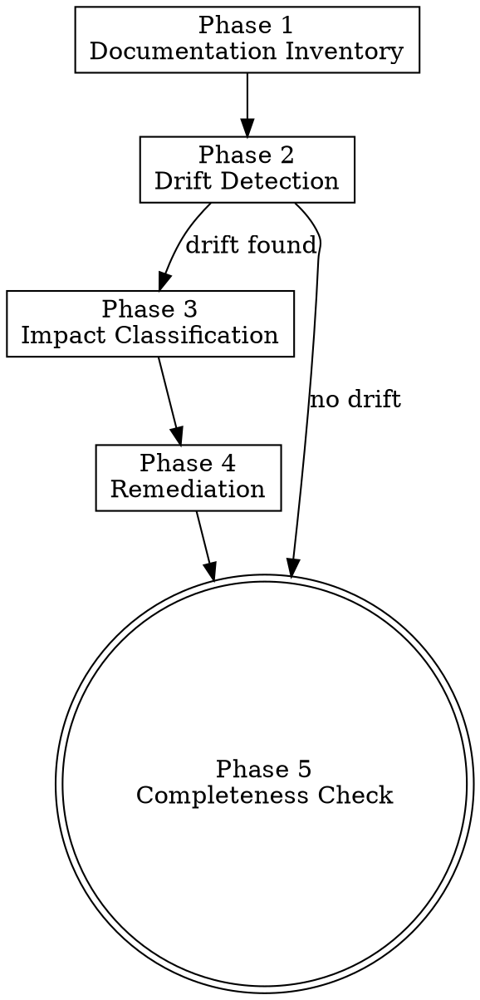

# Doc Governance

> **Pillar**: Deliver | **ID**: `deliver-doc-governance`

## Purpose

Documentation drift detection and synchronization. Ensures READMEs, API docs, and inline documentation stay accurate as code evolves. Treats documentation as a first-class deliverable.

## Activation Triggers

- "update docs", "docs are stale", "check documentation"
- "sync README", "API docs", "documentation drift"
- Automatically chained after `feature-builder` or `architecture-planner` when public APIs change

## Methodology

### Process Flow



### Phase 1 — Documentation Inventory
1. Locate all documentation files:
   - `README.md` at root and in subdirectories
   - `docs/` folder content
   - API documentation (OpenAPI/Swagger, JSDoc, docstrings)
   - Inline code comments in public interfaces
   - `CHANGELOG.md`, `CONTRIBUTING.md`
2. Map documentation → code relationships

### Phase 2 — Drift Detection
Compare documentation against current code:

| Check | Method |
|---|---|
| **API signatures** | Compare documented function signatures vs. actual |
| **Configuration** | Compare documented env vars/config vs. actual usage |
| **Installation** | Verify documented install steps still work |
| **Examples** | Check if code examples still compile/run |
| **Architecture** | Compare documented structure vs. actual file tree |
| **Dependencies** | Compare documented requirements vs. actual manifests |

For each drift found:
```
DRIFT: {doc file}:{line} — {what's documented} ≠ {what's actual}
```

### Phase 3 — Impact Classification

| Severity | Criteria |
|---|---|
| **Critical** | Wrong API usage instructions — will cause errors for users |
| **High** | Missing documentation for new public features |
| **Medium** | Outdated examples, stale screenshots, wrong file paths |
| **Low** | Minor wording inaccuracies, formatting issues |

### Phase 4 — Remediation
For each drift:
1. Generate the corrected documentation
2. Preserve the existing documentation style and voice
3. Add/update code examples that are verified to work
4. Update any auto-generated content (table of contents, API reference)

### Phase 5 — Completeness Check
Verify minimum documentation exists:
- [ ] README with project description, setup, usage
- [ ] API documentation for all public interfaces
- [ ] Configuration reference for all env vars/settings
- [ ] Contributing guide (for open source)
- [ ] Changelog (if releases are managed)

## Tools Required

- `codebase` — Read source code and documentation files
- `terminal` — Verify install steps, run examples
- `crewpilot_knowledge_search` — Check if documentation decisions were previously recorded

## Output Format

```
## [CrewPilot → Doc Governance]

### Documentation Map
| Doc File | Covers | Status |
|---|---|---|
| {path} | {what it documents} | {current/stale/missing} |

### Drift Detected
#### [{severity}] {doc file}:{line}
**Documented**: {what the doc says}
**Actual**: {what the code does}
**Fix**: {corrected content}

---
(repeat per drift)

### Completeness
{checklist with status}

### Summary
{N} drifts found: {critical}/{high}/{medium}/{low}
```

## Chains To

- `change-management` — Commit documentation updates
- `architecture-planner` — If architecture docs need major restructuring

## Anti-Patterns

- Do NOT rewrite documentation in a different voice/style
- Do NOT add documentation for internal/private APIs unless asked
- Do NOT remove valid documentation just because it's verbose
- Do NOT generate placeholder documentation ("TODO: add docs")

## Verification

**Evidence produced:**

- Drift-detection report mapping every changed public API, config key, or CLI surface to its corresponding doc location (or `MISSING`).
- Stale-doc list with last-modified timestamps and the source change that invalidated each doc.
- Updated-docs diff produced (or, when updates are declined, an explicit list of accepted-stale items).

**Completion gates:**

- [ ] Every public API or config change is mapped to a doc verdict (in-sync / drift / missing / not-required-with-reason).
- [ ] Updated docs preserve the project's existing voice and structure.
- [ ] No placeholder text ("TODO: add docs", "see implementation") in delivered updates.
- [ ] Internal/private surfaces are not documented unless explicitly requested.

**Blocking conditions:**

- Drift detected and updates declined without a stated reason → surface as a release blocker.
- Generated docs contradict the code → do not commit; rewrite from the source of truth.
- Doc location ambiguous → ask the user instead of writing in the wrong place.
