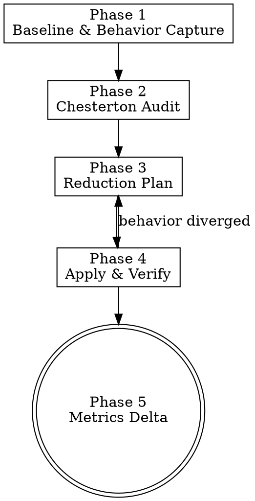

# Code Simplification

> **Pillar**: Engineer | **ID**: `engineer-code-simplification`

## Purpose

Reduce cognitive load and surface area in existing code while preserving observable behavior. Applies Chesterton's Fence (do not remove what you do not understand) and behavior-preservation discipline so that simplification never silently changes semantics.

## Activation Triggers

- "simplify this", "reduce complexity", "clean this up", "refactor for clarity", "shorten this"
- "this file is too big", "split this", "extract this", "inline that"
- Routed automatically when the active session role is `✨ Simplify`
- Invoked by `insights-pattern-detection` when a high-priority complexity finding is selected for remediation

## Methodology

### Process Flow



### Phase 1 — Baseline & Behavior Capture

1. Identify the unit being simplified (file, module, function, class).
2. Run `crewpilot_metrics_complexity` to record current cyclomatic and cognitive complexity.
3. Run `crewpilot_metrics_coverage` to record current line and branch coverage.
4. Confirm a regression-test surface exists. If no tests cover the unit, generate characterization tests first via `engineer-test-first` and stop until they pass.
5. Capture a behavioral snapshot: input/output examples, observable side effects (logs, metrics, file writes, network calls), exception paths.

### Phase 2 — Chesterton Audit

For every candidate for removal, inlining, or extraction, answer all three questions before touching the code:

1. **Why does this exist?** Trace the introducing commit via git blame; read the original PR description.
2. **What invariant does it protect?** Identify the constraint, edge case, or downstream consumer that motivated the code.
3. **What evidence proves the invariant no longer applies?** Specific test, removed call site, deprecated API, replaced subsystem.

If any of the three answers is "I do not know", the candidate is OUT OF SCOPE for this simplification. Do not remove or alter it.

### Phase 3 — Reduction Plan

Produce an ordered plan, smallest reversible step first. Allowed reduction types:

- Delete dead code (unreachable, unused exports, commented-out blocks).
- Inline single-use abstractions whose extraction added more indirection than clarity.
- Extract repeated patterns into a single named primitive.
- Replace conditional pyramids with early returns or polymorphism.
- Consolidate types/interfaces with overlapping shapes.
- Remove parameters that are never varied at any call site.
- Eliminate boolean trap parameters in favor of named operations.

Forbidden under simplification:

- Behavior changes (timing, ordering, error types, log levels).
- API surface breakage without an explicit migration plan from `deliver-deprecation-migration`.
- Performance trade-offs not measured against the Phase 1 baseline.

### Phase 4 — Apply & Verify

Execute one reduction at a time:

1. Apply the change.
2. Run the full test suite, not just the affected unit's tests.
3. Compare observable side effects to the Phase 1 snapshot.
4. If any test fails or any observable changed, revert this single step and either escalate the change or drop it.
5. Commit per reduction step using `deliver-change-management` to keep diffs small and reviewable.

### Phase 5 — Metrics Delta

After all reductions are applied:

1. Re-run `crewpilot_metrics_complexity` and `crewpilot_metrics_coverage`.
2. Report the delta against Phase 1 (lines removed, complexity reduction, coverage delta).
3. Persist a knowledge entry (type `pattern`) summarizing the simplification, including any candidates rejected by the Chesterton audit so future passes do not repeat them.

## Tools Required

- `crewpilot_metrics_complexity` — Baseline and post-simplification cyclomatic and cognitive scores.
- `crewpilot_metrics_coverage` — Confirm coverage does not regress.
- `crewpilot_git_log` — git blame and PR history for the Chesterton audit.
- `crewpilot_git_diff` — Per-step diff inspection.
- `crewpilot_artifact_write` — Persist baseline snapshot and final delta report.
- `crewpilot_knowledge_store` — Record the simplification pattern and any rejected candidates.
- `crewpilot_exec` — Run test suites between reduction steps.

## Output Format

```markdown
## [CrewPilot → Code Simplification]

### Scope
**Unit**: {file/module/function}
**Baseline complexity**: cyclomatic {N}, cognitive {M}
**Baseline coverage**: line {L}%, branch {B}%

### Chesterton Audit
| Candidate | Why it exists | Invariant | Evidence invariant is gone | Verdict |
|-----------|---------------|-----------|----------------------------|---------|
| {symbol}  | {reason}      | {rule}    | {evidence}                 | KEEP / REMOVE |

### Reduction Plan
1. {step} — type: {dead-code/inline/extract/...} — risk: {low/med/high}
2. ...

### Apply Log
| Step | Result | Tests | Observables | Action |
|------|--------|-------|-------------|--------|
| 1    | applied | pass | unchanged | committed |
| 2    | reverted | fail | logs differ | dropped |

### Metrics Delta
- Lines: {-N} ({-pct}%)
- Cyclomatic: {-N}
- Cognitive: {-N}
- Coverage: line {±delta}%, branch {±delta}%

### Knowledge Entry
- ID: {entry-id}
- Tags: {tags}
- Rejected candidates recorded: {count}

### Confidence: {N}/10
```

## Chains To

- `engineer-test-first` — Generate characterization tests when the unit lacks a regression surface.
- `deliver-change-management` — Commit each reduction step with conventional-commit hygiene.
- `deliver-deprecation-migration` — Required when simplification touches a public API.
- `insights-pattern-detection` — Re-scan to confirm the targeted findings are resolved.
- `insights-knowledge-base` — Persist patterns and rejected candidates.

## Anti-Patterns

- Do NOT simplify code without a regression-test surface. Generate characterization tests first.
- Do NOT remove anything whose original purpose you cannot explain. Chesterton's Fence applies absolutely.
- Do NOT change observable behavior under the banner of simplification. Behavior-changing refactors belong in `engineer-feature-builder` with explicit acceptance criteria.
- Do NOT bundle multiple reductions into one commit. Each step must be independently revertible.
- Do NOT chase line-count reduction at the cost of clarity. Fewer lines that nobody can read is not progress.
- Do NOT rewrite into a different paradigm (functional ↔ OO, sync ↔ async) under simplification. Paradigm shifts are architecture decisions.
- Do NOT skip the metrics delta. Without baseline-vs-after numbers, the simplification claim is unverifiable.

## Anti-Rationalizations

| Rationalization | Rebuttal |
|---|---|
| "This dead code is obviously unused, the audit is overkill" | Obvious-looking dead code is the most common Chesterton's Fence violation. Do the audit; it costs minutes and prevents incident-grade regressions. |
| "Tests pass, the change must be safe" | Tests cover known behavior. Observable side effects (logs, metrics, ordering) routinely escape test coverage. Compare the snapshot. |
| "Bundling reductions saves review effort" | Bundled reductions are bundled risk. A single bad step in a bundle requires reverting everything. |
| "I will write characterization tests after the simplification" | After-the-fact tests assert what the simplified code does, not what the original code did. They prove nothing. |
| "Performance might improve, that is just a bonus" | Performance changes are behavior changes. Measure against the baseline or do not claim them. |
| "This abstraction has only one caller, definitely inline it" | One caller today. Check the abstraction's PR history for prior callers and the reason it was extracted. |
| "Reducing line count by 30% is the win, the metrics delta is bookkeeping" | Without metrics, the claim is opinion. The delta is the deliverable, not paperwork. |

## Verification

**Evidence produced:**

- Phase 1 baseline snapshot persisted as artifact (complexity, coverage, observable side effects).
- Chesterton audit table with verdict per candidate.
- Reduction plan with risk-tagged ordered steps.
- Apply log recording per-step result, test outcome, observable comparison, and action taken.
- Metrics delta report comparing baseline to final state.
- Knowledge-base entry with the pattern and rejected candidates.

**Completion gates:**

- [ ] Regression-test surface existed before any reduction was applied (or characterization tests were generated and pass).
- [ ] Every applied reduction has a Chesterton audit row with all three questions answered.
- [ ] Each reduction was committed independently; no bundled steps.
- [ ] Full test suite is green at the end (not just the affected unit).
- [ ] Observable side effects match the Phase 1 snapshot.
- [ ] Metrics delta reported with absolute and percentage values.

**Blocking conditions:**

- Any test that was passing on the base branch is now failing → revert the offending step; do not declare complete.
- Any observable side effect changed → revert the offending step; reclassify the change as a behavior change.
- A removal candidate has any of the three Chesterton questions unanswered → drop the candidate from the plan.
- Coverage regressed → either restore coverage or revert; do not ship a coverage drop under simplification.
