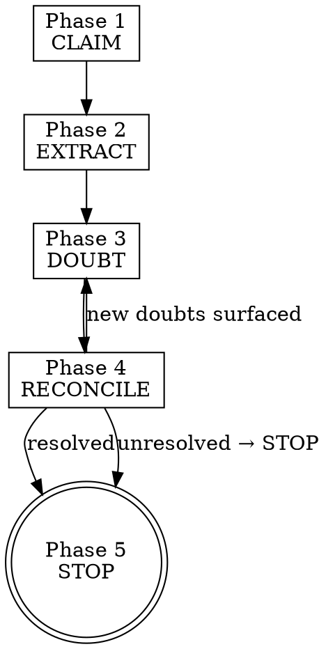

# Doubt-Driven Development

> **Pillar**: Engineer | **ID**: `engineer-doubt-driven-development`

## Purpose

A structured rigor cycle for high-stakes claims and decisions where confident-sounding output is the dominant failure mode. Runs CLAIM → EXTRACT → DOUBT → RECONCILE → STOP so that the agent refuses to ship answers whose foundations cannot be verified, rather than producing plausible fabrications.

## Activation Triggers

- "I am not sure about", "double-check this", "are we certain", "what if I am wrong", "verify this claim"
- High-stakes decisions: production migrations, irreversible operations, security-sensitive code, data-loss-risk changes
- Invoked by `autopilot-worker` Phase 2 when the analysis surfaces an assumption that, if wrong, would invalidate the plan
- Invoked by `assure-pr-intelligence` when an acceptance criterion has ambiguous evidence
- Manually invoked when the agent itself notices uncertainty: "before I proceed, run doubt"

## Methodology

### Process Flow



### Phase 1 — CLAIM

State the assertion under investigation in one declarative sentence. The claim must be:

- **Falsifiable**: there exists evidence that would prove it wrong.
- **Bounded**: scoped to a specific system, version, or time.
- **Singular**: one claim per cycle. Compound claims decompose into multiple cycles.

Examples of well-formed claims:

- "Calling `db.exec(query)` with parameters from the request body is safe because the driver parameterizes on this version."
- "Removing the retry wrapper around `fetchUser` will not change observable behavior because the call site already handles errors."

Examples of ill-formed claims (reject and reformulate):

- "The code is fine." (not falsifiable)
- "Most users will not notice." (not bounded)
- "It is fast and correct." (compound)

### Phase 2 — EXTRACT

Decompose the claim into atomic verifiable parts. Every part must be independently checkable. For each part, name:

1. **The assertion**: a single fact the part depends on.
2. **The evidence type**: what would prove this part — official documentation, source code, test, runtime measurement, written agreement.
3. **The evidence source**: a specific URL, file path, version, or person.

Stop adding parts when the union of parts implies the original claim. Three to seven parts is typical.

### Phase 3 — DOUBT

For each part, generate at least one concrete counterfactual:

- **Boundary**: what value, version, environment, or input would make this part false?
- **Inversion**: what does the opposite of the assertion look like, and have we seen it?
- **Update risk**: when did the underlying source last change?
- **Authority gap**: is the evidence source the actual source of truth, or is it derivative?

Forbidden as doubts (reject and replace):

- "It might fail." (no concrete failure mode)
- "Maybe the docs are wrong." (no specific dispute)
- "Edge cases exist." (name the edge case)

### Phase 4 — RECONCILE

For each part with active doubts, take exactly one of three actions:

1. **Verify**: produce the named evidence (read the doc, run the test, check the source). If verified, mark the part RESOLVED with the evidence cited.
2. **Refute**: the doubt is correct, the part is false. Mark the part FALSE and propagate the consequence to the original claim.
3. **Accept gap**: when verification is not feasible in the current session, mark the part UNRESOLVED with a written gap statement naming what would resolve it and who can resolve it.

Reconciliation may surface new doubts. Loop back to Phase 3 until no new doubts emerge or the gap is explicitly accepted.

### Phase 5 — STOP

Stop conditions:

- **Original claim verified**: every part RESOLVED with cited evidence → declare the claim verified, proceed.
- **Original claim refuted**: any part FALSE → propagate refutation, restart from a corrected claim or escalate.
- **Unresolved gaps remain on a high-stakes claim**: STOP. The agent MUST NOT proceed with the dependent action. Surface the gap statements to the user and let them decide whether to (a) provide the missing evidence, (b) accept the gap as a known unknown with named consequences, or (c) abort the dependent action.

A high-stakes claim is one where being wrong would: cause data loss, ship a security regression, break a production system, mislead a downstream decision, or create a compliance or legal exposure.

## Tools Required

- `crewpilot_artifact_write` — Persist the doubt cycle as an auditable artifact.
- `crewpilot_knowledge_search` — Check past doubt cycles for the same claim or assumption family.
- `crewpilot_knowledge_store` — Record the cycle outcome (verified, refuted, gap-accepted) for future reuse.
- `crewpilot_git_log` — Inspect history when the claim depends on past commits or removed code.
- General read/search tools to retrieve evidence sources.

## Output Format

```markdown
## [CrewPilot → Doubt-Driven Development]

### CLAIM
{single declarative falsifiable bounded sentence}

### EXTRACT (atomic parts)
| # | Assertion | Evidence type | Evidence source |
|---|-----------|---------------|-----------------|
| 1 | ...       | ...           | ...             |
| 2 | ...       | ...           | ...             |

### DOUBT
| Part # | Doubt | Doubt type |
|--------|-------|------------|
| 1      | ...   | boundary / inversion / update / authority |

### RECONCILE
| Part # | Action | Evidence or gap statement | Status |
|--------|--------|---------------------------|--------|
| 1      | verify | ...                       | RESOLVED |
| 2      | gap    | ...                       | UNRESOLVED |

### STOP verdict
{ VERIFIED | REFUTED | GAP_ACCEPTED | STOP_DO_NOT_PROCEED }

### Consequences
{what this verdict means for the dependent action}

### Knowledge entry
- ID: {entry-id}
- Tags: {tags}
- Reusable for future claims about: {assumption family}

### Confidence: {N}/10
```

## Chains To

- `engineer-source-driven-development` — When evidence requires citing official documentation for a framework or library claim.
- `assure-pr-intelligence` — Doubt cycle evidence resolves ambiguous acceptance criteria.
- `insights-knowledge-base` — Persist verified or refuted claims for reuse.
- `autopilot-worker` — Resume the calling pipeline phase only after STOP verdict is `VERIFIED` or explicit `GAP_ACCEPTED` from the user.

## Anti-Patterns

- Do NOT skip CLAIM. An unstated claim cannot be doubted; the cycle becomes vibes.
- Do NOT use "maybe", "might", or "could" as doubts. Doubts must name a concrete failure mode or contradicting evidence path.
- Do NOT mark a part RESOLVED based on intuition. The evidence row must cite a retrievable source.
- Do NOT accept gaps silently. Every UNRESOLVED part must surface in the STOP verdict and to the user.
- Do NOT proceed past STOP_DO_NOT_PROCEED on a high-stakes claim. That is the entire point of the skill.
- Do NOT run this cycle on trivial claims. Doubt-driven costs time; reserve it for high-stakes assertions.

## Anti-Rationalizations

| Rationalization | Rebuttal |
|---|---|
| "I am pretty sure about this, the cycle is overkill" | Pretty-sure is exactly the failure mode the cycle protects against. Confidence without evidence is the symptom. |
| "We do not have time to verify every part" | Then the claim is not ready to act on. Either accept the gap explicitly or de-scope to a smaller claim that can be verified. |
| "The doc must still be accurate, no need to check" | Documentation lag is the most common source of agent hallucination. Date-check the source. |
| "Compound claim is fine, we can reason holistically" | Holistic reasoning hides the part that is false. Decompose, even when the parts feel obvious. |
| "Boundary doubt is contrived, that input never appears" | Inputs that never appear become inputs that always appear after the next refactor. Note the boundary or name the invariant that prevents it. |
| "Accepting the gap is the same as verifying" | A named gap is a known unknown a human can decide on. A silently skipped verification is a hidden assumption that ships. |
| "STOP feels too aggressive, just flag it as a warning" | Warnings on high-stakes claims are routinely ignored. The STOP verdict forces the dependent action to wait for a decision. |

## Verification

**Evidence produced:**

- Single CLAIM sentence captured and validated against falsifiable, bounded, singular criteria.
- EXTRACT table with at least three atomic parts, each with assertion, evidence type, evidence source.
- DOUBT table with at least one concrete counterfactual per part.
- RECONCILE table with action and outcome per part.
- STOP verdict and consequence statement.
- Knowledge-base entry recording verified or refuted parts for reuse.

**Completion gates:**

- [ ] CLAIM passes the three well-formed criteria (falsifiable, bounded, singular).
- [ ] Every EXTRACT part names a specific evidence type and source, not a vague pointer.
- [ ] Every DOUBT row names a concrete failure mode, not "maybe" / "might" hedging.
- [ ] Every RECONCILE row has an action of verify / refute / gap; no row left without a status.
- [ ] STOP verdict matches the RECONCILE state (no `VERIFIED` when any part is `UNRESOLVED`).
- [ ] Knowledge entry stored with tags identifying the assumption family.

**Blocking conditions:**

- High-stakes claim with any UNRESOLVED part not explicitly accepted by the user → STOP_DO_NOT_PROCEED; the dependent action MUST NOT proceed.
- Any DOUBT row uses hedging language without a concrete failure mode → reject and rewrite the doubt before reconcile.
- Evidence source cited as "common knowledge" or "obvious" without a retrievable pointer → reject; replace with a real source or mark the part as gap.
- New doubts surfaced during reconcile but the cycle was closed without re-entering Phase 3 → re-open the cycle.
