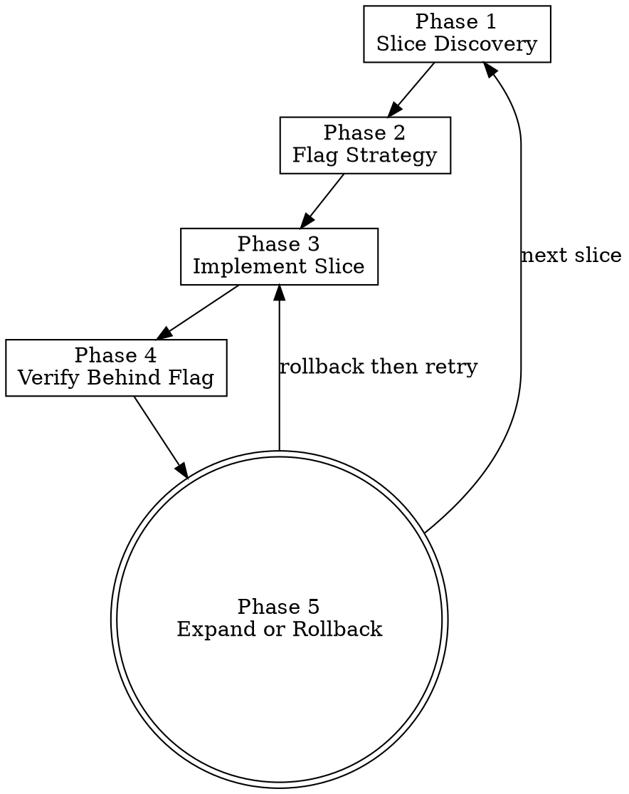

# Incremental Implementation

> **Pillar**: Engineer | **ID**: `engineer-incremental-implementation`

## Purpose

Carve complex or risky work into thin end-to-end vertical slices, each delivered behind a default-off feature flag with an explicit rollback path. Replaces the dominant failure mode of "big-bang" implementations (long-lived branches, untestable intermediate states, irreversible production changes) with a stream of independently-shippable, reversible steps. Default routing for moderate and complex tier features inside `autopilot-worker`.

## Activation Triggers

- "build this incrementally", "ship behind a flag", "thin slice", "vertical slice", "phased rollout"
- A feature touches multiple layers (API, data, UI, ops) and would otherwise live on a long-lived branch.
- A change is risky enough that a runtime kill-switch is required.
- Routed by `engineer-feature-builder` Phase 0 when the complexity tier is moderate or complex.
- Routed by `autopilot-worker` Phase 4 when the implementation phase begins.

## Methodology

### Process Flow



### Phase 1 — Slice Discovery

1. Decompose the feature into the thinnest possible end-to-end slices. A slice is valid only if:
   - It exercises every layer touched by the final feature (API to data to UI when applicable).
   - It is observable end-to-end (one user-visible or system-visible outcome).
   - It is independently shippable behind a flag.
   - It can be reverted by toggling the flag without a code change.
2. Reject pseudo-slices: layer-only stages ("first the data model", "then the API"), schema migrations without consumers, UI shells without backing logic.
3. Order slices by risk-adjusted value: highest-risk slice first, so that when something fails it fails early.

### Phase 2 — Flag Strategy

For every slice, define:

| Field | Requirement |
|-------|-------------|
| Flag name | Unique, kebab-case, prefixed by feature scope (`order-flow-checkout-v2`). |
| Default state | OFF in every environment until the slice exits Phase 4 verification. |
| Activation order | Local → CI → staging → percentage rollout in production → full enable. |
| Kill-switch behavior | What the system does when the flag flips back to OFF mid-request. |
| Cleanup criterion | The condition under which the flag and the OFF code path are removed. |

Flags without a documented cleanup criterion are forbidden — they become permanent forks of behavior.

### Phase 3 — Implement Slice

1. Branch from the integration branch; do not stack slices on long-lived branches.
2. Implement the slice end-to-end behind the flag (`if (flag.enabled) ...`).
3. Add tests that exercise both flag states (ON and OFF) so the OFF code path is provably unchanged.
4. The implementation must compile, lint, type-check, and pass tests with the flag OFF — that is the safe-default state.
5. Use `engineer-test-first` for the ON-state tests; the slice's user-visible outcome is the test specification.

### Phase 4 — Verify Behind Flag

1. Local verification: enable flag locally, run the slice end-to-end, confirm the user-visible outcome.
2. CI verification: full suite green with flag OFF and full suite green with flag ON.
3. Staging verification: deploy with flag OFF; turn flag ON for the test cohort; observe.
4. Production verification: deploy with flag OFF; ramp progressively (1% → 5% → 25% → 100%) with telemetry between each step.
5. At every ramp stage, define the rollback signal in advance: a metric or alert that, if it fires, automatically returns the flag to OFF.

### Phase 5 — Expand or Rollback

After a slice is fully ramped:

1. **Expand**: declare the slice complete; record the telemetry baseline; route to Phase 1 for the next slice.
2. **Rollback**: if any rollback signal fires at any ramp stage, return the flag to OFF, capture the failure mode in a `lesson` knowledge entry, and either redesign the slice or escalate. Do not retry the same slice without a written diagnosis.

When all slices are shipped and stable for the documented bake period:

1. Remove the flag and the OFF code path in a dedicated cleanup commit (chained to `deliver-deprecation-migration` for any shimmed surfaces).
2. Persist a `pattern` knowledge entry recording the slice plan that worked, for reuse on similar features.

## Tools Required

- `crewpilot_artifact_write` — Persist slice plan, flag strategy, ramp telemetry, and rollback log.
- `crewpilot_metrics_complexity` — Confirm slices stay within complexity budgets.
- `crewpilot_metrics_coverage` — Confirm both flag states are covered.
- `crewpilot_knowledge_store` — Record the slice plan and any rollbacks as reusable patterns and lessons.
- `crewpilot_exec` — Run tests, deploy commands, ramp toggles.
- `crewpilot_session_save` — Save state between ramp stages so the workflow resumes correctly.

## Output Format

```markdown
## [CrewPilot → Incremental Implementation]

### Slice Plan
| # | Slice | Layers exercised | Risk | Order |
|---|-------|------------------|------|-------|
| 1 | ...   | API, data, UI    | high | 1     |

### Flag Strategy
| Slice # | Flag name | Default | Ramp order | Kill-switch | Cleanup criterion |
|---------|-----------|---------|------------|-------------|-------------------|
| 1       | order-... | OFF     | local→CI→staging→1%→100% | route returns to v1 | flag stable at 100% for 14 days |

### Implementation Log
| Slice # | Status | OFF tests | ON tests | Verified at | Rollback signal |
|---------|--------|-----------|----------|-------------|-----------------|
| 1       | RAMPING | 142 pass | 28 pass | staging | error rate >0.1% |

### Ramp Telemetry
- 1% → ... — observed: ...
- 5% → ... — observed: ...

### Cleanup
- Flag removed at: {commit-sha}
- OFF path removed: {yes/no}
- Knowledge entry: {entry-id}

### Confidence: {N}/10
```

## Chains To

- `engineer-test-first` — Tests for both flag states are authored test-first.
- `engineer-feature-builder` — Per-slice implementation runs through feature-builder's verification.
- `deliver-change-management` — Each slice ships as a coherent commit set with conventional-commit hygiene.
- `deliver-deploy-guard` — Required at every ramp stage that crosses an environment boundary.
- `deliver-deprecation-migration` — Flag cleanup uses the deprecation-migration playbook for the OFF code path.
- `insights-knowledge-base` — Slice plans and rollbacks persist as reusable patterns and lessons.

## Anti-Patterns

- Do NOT carve slices along architectural layers ("first the model layer"). Slices must be end-to-end.
- Do NOT ship a feature flag without a cleanup criterion. Permanent forks are the cost.
- Do NOT default flags to ON. The OFF state is the safe default; it preserves rollback.
- Do NOT skip the OFF-state test. Without it, the safe default is unverified.
- Do NOT ramp without a pre-defined rollback signal. "We will look at the dashboards" is not a signal.
- Do NOT batch-deploy multiple slices behind a single flag. Each slice has its own flag and its own ramp.
- Do NOT retry a rolled-back slice without a written diagnosis. Repetition without diagnosis reproduces the same failure.

## Anti-Rationalizations

| Rationalization | Rebuttal |
|---|---|
| "This feature is too coupled to slice" | Coupling is the symptom of bad slice boundaries, not the absence of them. The first slice is the discovery exercise. |
| "Feature flags add complexity, the diff is cleaner without them" | Cleaner diff, riskier deploy. The flag is the rollback mechanism; complexity is its purpose. |
| "OFF-state tests are redundant, we have integration tests" | Integration tests typically run with all flags in their default state and miss regressions in the OFF path. |
| "We can ramp directly to 100% — staging looked fine" | Staging environments do not have production traffic shape. Progressive ramps exist because staging always looks fine. |
| "Cleanup can come later, the flag is harmless" | Forgotten flags become permanent dead branches. Cleanup is part of the slice, not optional follow-up. |
| "The slice is too small to be useful on its own" | A slice that has no user-visible or system-visible outcome is a layer, not a slice. Resize until it does. |
| "Rollback signal is too strict, we will get false positives" | Tune the signal, do not remove it. False positives are recoverable; missing rollbacks are not. |

## Verification

**Evidence produced:**

- Slice plan artifact with one row per slice meeting all four validity criteria.
- Flag strategy table with all five required fields per slice.
- Implementation log per slice covering OFF tests, ON tests, verification environment, and rollback signal.
- Ramp telemetry log capturing observed values at each ramp stage.
- Cleanup record listing the commit that removes the flag and the OFF code path.
- Knowledge entries: a `pattern` for the successful plan; `lesson` entries for any rollbacks.

**Completion gates:**

- [ ] Every slice in the plan exercises every layer the final feature touches.
- [ ] Every flag has an OFF default and a written cleanup criterion.
- [ ] Both flag states are covered by tests.
- [ ] Each ramp stage has a pre-defined rollback signal.
- [ ] Cleanup commit removes the flag, the OFF code path, and any compatibility shim.
- [ ] Knowledge entries stored for the plan and any rollbacks.

**Blocking conditions:**

- A slice is layer-only or has no user-visible/system-visible outcome → reject; redesign the slice.
- A flag has no cleanup criterion → reject; either define the criterion or do not introduce the flag.
- A rollback signal is missing for a ramp stage → halt the ramp; define the signal first.
- A rolled-back slice is being retried without a written diagnosis → halt; produce the diagnosis as a `lesson` entry first.
- Flag-cleanup commit was skipped after stable bake period → block the next slice's ramp until cleanup is done.
