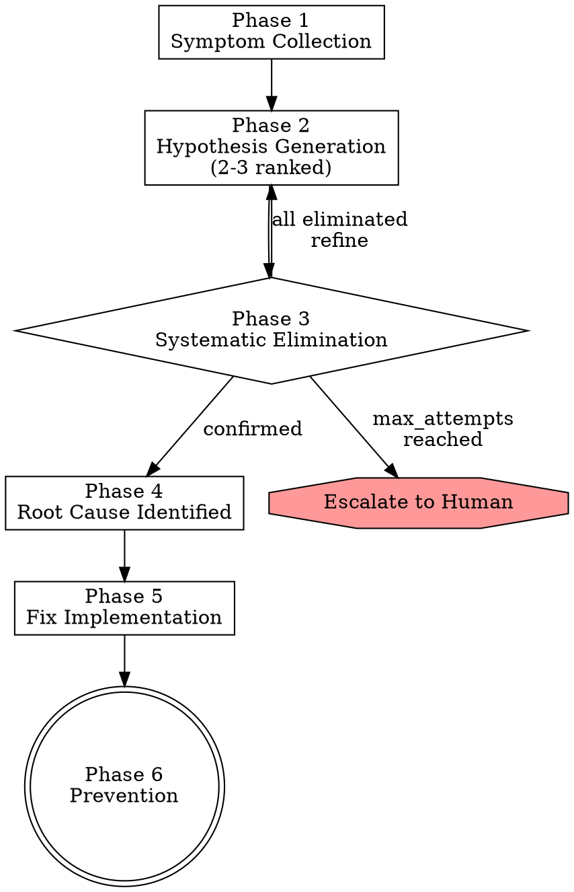

# Root Cause Analysis

> **Pillar**: Engineer | **ID**: `engineer-root-cause-analysis`

## Purpose

Systematic debugging that finds the actual root cause, not just the symptom. Uses a structured hypothesis-test-eliminate approach with a maximum attempt budget to prevent rabbit holes.

## Activation Triggers

- "debug this", "fix this error", "why is this crashing", "investigate"
- "root cause", "not working", "broken", "unexpected behavior"
- Any error message, stack trace, or unexpected output

## Methodology

### Process Flow



### Phase 1 — Symptom Collection
1. Gather all available evidence:
   - Error message / stack trace
   - Steps to reproduce
   - When it started (recent changes?)
   - Environment details (dev/staging/prod, OS, runtime version)
2. Reproduce the issue if possible (run the failing code/test)
3. Check git log for recent changes to affected files

### Phase 2 — Hypothesis Generation
Generate 2-3 ranked hypotheses:

| # | Hypothesis | Likelihood | Evidence | How to Test |
|---|---|---|---|---|
| H1 | {most likely cause} | High | {what points here} | {test strategy} |
| H2 | {alternative cause} | Medium | {what points here} | {test strategy} |
| H3 | {edge case cause} | Low | {what points here} | {test strategy} |

### Phase 3 — Systematic Elimination
For each hypothesis (highest likelihood first):
1. **Test**: Run the specific validation (add logging, modify input, check state)
2. **Observe**: What happened? Does it confirm or eliminate?
3. **Record**: Document result before moving to next hypothesis
4. **Refine**: If partially confirmed, narrow the hypothesis

Track progress:
```
Attempt 1/5: Testing H1 — {result} → {confirmed/eliminated/narrowed}
Attempt 2/5: Testing H2 — {result} → {confirmed/eliminated/narrowed}
```

Stop at `max_attempts` from config (default: 5). If root cause not found, report what was eliminated and recommend next steps.

### Phase 4 — Root Cause Identification
When found:
1. State the root cause in one sentence
2. Explain the causal chain: trigger → intermediate effects → symptom
3. Explain WHY the code was vulnerable to this (design gap, missing validation, etc.)

### Phase 5 — Fix Implementation

<HARD-GATE>
Do NOT implement a fix until the root cause has been identified in Phase 4.
Do NOT fix symptoms — the fix MUST address the root cause.
If the root cause is still unknown after max_attempts, escalate to human instead of guessing.
</HARD-GATE>

1. Implement the minimal fix
2. Add a regression test that fails without the fix
3. Run the full test suite to verify no regressions
4. If the fix reveals a systemic issue, note it for `pattern-detection`

### Phase 6 — Prevention
1. Identify what would have caught this earlier (better tests, type safety, validation)
2. Suggest ONE concrete prevention measure

## Tools Required

- `codebase` — Read failing code, trace call chains
- `terminal` — Run code, execute tests, check logs
- `crewpilot_git_log` — Check recent changes
- `crewpilot_git_diff` — Compare working vs. broken state

## Output Format

```
## [CrewPilot → Root Cause Analysis]

### Symptom
{error/behavior description}

### Investigation
{hypothesis table}

### Elimination Log
{attempt-by-attempt results}

### Root Cause
**{one sentence}**

Causal chain:
{trigger} → {intermediate} → {symptom}

**Design gap**: {why code was vulnerable}

### Fix
{code change with explanation}

### Regression Test
{test that validates the fix}

### Prevention
{one concrete measure}
```

## Chains To

- `test-first` — Write the regression test
- `code-quality` — Review the fix for quality
- `pattern-detection` — If this reveals a systemic issue
- `knowledge-base` — Store the root cause for future reference

## Anti-Patterns

- Do NOT guess the fix without testing hypotheses
- Do NOT exceed max_attempts — report what you know and escalate
- Do NOT fix the symptom without finding the root cause
- Do NOT skip the regression test
- Do NOT modify code while investigating (observe first, fix after)

## Verification

**Evidence produced:**

- Symptom-collection record (logs, repro steps, environment).
- Hypothesis table with likelihood, test strategy, and an Evidence column populated as elimination proceeds.
- Elimination log naming each hypothesis confirmed or eliminated and how.
- Root-cause statement distinguishing root cause from symptom.
- Regression test that fails before the fix and passes after.
- Prevention note (lint rule, test pattern, doc update) when applicable.

**Completion gates:**

- [ ] Root cause is named explicitly; the fix targets the cause, not the symptom.
- [ ] Regression test exists, was run before the fix (failing), and after (passing).
- [ ] Investigation stayed within `max_attempts` from `crewpilot.config.json`.
- [ ] Knowledge-base entry stored (type `lesson`) capturing the failure mode.

**Blocking conditions:**

- Root cause cannot be identified within `max_attempts` → stop, document the state, and escalate; do not guess a fix.
- Symptom-only fix proposed → reject and continue investigation.
- No regression test added → cannot declare complete.
