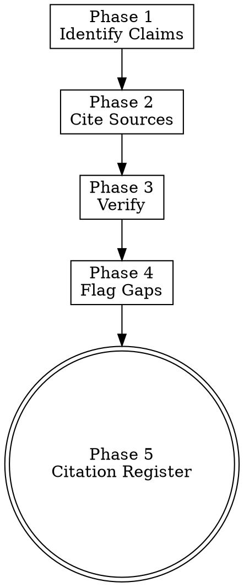

# Source-Driven Development

> **Pillar**: Engineer | **ID**: `engineer-source-driven-development`

## Purpose

Every claim about a framework, library, language feature, runtime behavior, or external API must be backed by an official source — documentation, source code, release notes, or specification — cited inline. Refuses to ship code that depends on unverifiable assertions about external systems. Primary defense against the most common AI failure mode: confidently invoking APIs that do not exist or behave differently than asserted.

## Activation Triggers

- Implementation depends on a third-party library, framework, or runtime API.
- "Cite the source", "where is this documented", "is this the right API", "what does this function actually do"
- Routed automatically by `autopilot-worker` Phase 4 when implementing against an unfamiliar dependency.
- Routed by `engineer-doubt-driven-development` Phase 4 when reconciling an external-system claim.

## Methodology

### Process Flow



### Phase 1 — Identify Claims

Scan the proposed or existing implementation and extract every assertion about an external system. A claim is anything of these forms:

- "Library X exports function `Y` with signature `Z`."
- "Framework X handles concern `Y` automatically."
- "API endpoint `Z` returns shape `S` on success and shape `E` on failure."
- "Language feature `X` has semantic `Y` on runtime version `Z`."
- "Behavior `B` is configured by environment variable `E`."

Internal-codebase claims do not require source-driven verification (they are verifiable by reading the repository directly).

### Phase 2 — Cite Sources

For every claim, attach a citation row with:

| Field | Requirement |
|-------|-------------|
| Claim | One sentence, atomic. |
| Source type | `official-docs` / `source-code` / `release-notes` / `specification` / `vendor-blog`. |
| Source URL or path | Specific page, file, or git ref — not the project homepage. |
| Version | Exact library/framework version (`@1.4.2`, not `latest`). |
| Excerpt | The exact 1-3 line passage from the source that supports the claim. |
| Last verified | ISO-8601 timestamp of when the source was retrieved this session. |

`vendor-blog` and Stack Overflow answers are accepted only when no official source covers the claim and are flagged as `weak-source` for review.

### Phase 3 — Verify

For each citation:

1. Retrieve the source (read the file, fetch the page, run `--help`, inspect the type definitions).
2. Confirm the excerpt matches the claim exactly. Paraphrasing is not verification.
3. Confirm the version of the source matches the version pinned in the project (`package.json`, `requirements.txt`, `go.mod`, `Cargo.toml`, etc.).
4. Mark the claim VERIFIED, MISMATCHED (source contradicts the claim), or UNAVAILABLE (could not retrieve).

### Phase 4 — Flag Gaps

For every MISMATCHED or UNAVAILABLE claim:

- **MISMATCHED**: The implementation is using the API incorrectly. Halt; the implementation must be corrected to match the source, or the source must be updated and re-verified.
- **UNAVAILABLE**: Surface explicitly to the user with the gap statement: "Cannot verify claim X against source Y. Proceeding requires (a) producing the source, (b) accepting the risk in writing, or (c) replacing the dependency with one that has retrievable docs."

For weak-source citations, surface them in the verdict but do not block.

### Phase 5 — Citation Register

Persist the citation register:

1. `crewpilot_artifact_write` (phase `citations`) — full register attached to the workflow.
2. `crewpilot_knowledge_store` (type `pattern`, tag `source-driven`) — verified claims become reusable for future sessions, dramatically reducing future verification cost.

## Tools Required

- `crewpilot_artifact_write` — Persist citation register.
- `crewpilot_knowledge_search` — Check whether a claim was already verified in a past session.
- `crewpilot_knowledge_store` — Store newly verified claims for future reuse.
- `crewpilot_exec` — Run `--help`, version checks, type-definition retrieval.
- General read/fetch tools to retrieve documentation and source code.

## Output Format

```markdown
## [CrewPilot → Source-Driven Development]

### Claims Identified
| # | Claim | Subject |
|---|-------|---------|
| 1 | ...   | library@version |

### Citation Register
| # | Source type | Source URL/path | Version | Excerpt | Last verified |
|---|-------------|-----------------|---------|---------|---------------|
| 1 | official-docs | ... | ... | "..." | 2026-05-10T... |

### Verification
| # | Status | Notes |
|---|--------|-------|
| 1 | VERIFIED | excerpt matches claim |
| 2 | MISMATCHED | source says "..."; claim says "..." |
| 3 | UNAVAILABLE | docs site returned 404; no offline copy |

### Gap Surfacing
- {UNAVAILABLE/MISMATCHED claims with consequence and resolution path}

### Knowledge entries stored
- {entry-id}: {claim summary}

### Verdict
{ ALL_VERIFIED | GAPS_PRESENT | HALT_MISMATCH }

### Confidence: {N}/10
```

## Chains To

- `engineer-doubt-driven-development` — Source-driven supplies evidence rows for the reconcile phase.
- `engineer-feature-builder` — Implementation cannot declare complete on dependency-touching code unless source-driven returned `ALL_VERIFIED` or `GAPS_PRESENT` with explicit user acceptance.
- `assure-pr-intelligence` — Citation register is reviewer evidence in the PR narrative.
- `insights-knowledge-base` — Verified claims persist for future routing.

## Anti-Patterns

- Do NOT cite a project homepage. Cite the specific page or file containing the supporting passage.
- Do NOT paraphrase the excerpt. Copy the source text verbatim, three lines maximum.
- Do NOT claim VERIFIED on a `latest` or `main` reference. Pin the version that matches the project.
- Do NOT silently accept UNAVAILABLE claims. Every gap must surface in the verdict.
- Do NOT use search-engine summaries as a source. Retrieve the actual page.
- Do NOT verify against documentation for a different major version than the project pins.
- Do NOT build on a `vendor-blog` citation when an official source exists.

## Anti-Rationalizations

| Rationalization | Rebuttal |
|---|---|
| "This API is stable, no need to cite the version" | Stable APIs add fields, change defaults, and rename arguments between versions. Cite the version the project actually uses. |
| "Stack Overflow is faster than the official docs" | Stack Overflow answers age with the API. Use the official source; the SO answer is at best a pointer. |
| "I have seen this pattern many times, citation is busywork" | Pattern recognition is exactly the failure mode that produces hallucinated APIs. Cite once, store in knowledge base, reuse forever. |
| "The function obviously exists, the type checker will catch a mistake" | Type checkers catch shape mismatches in compiled languages; they do not catch semantic mistakes (idempotency, retry behavior, error envelope). |
| "Docs are out of date, the source code is the truth" | Then cite the source code, with the file path and a git-ref-pinned excerpt. The principle is unchanged. |
| "We can verify after the implementation works" | Working-by-coincidence is the most expensive bug class. Verify before the code lands, not after. |

## Verification

**Evidence produced:**

- Claims identified table covering every external-system assertion in the implementation diff.
- Citation register with all six required fields per row.
- Verification status per claim (VERIFIED / MISMATCHED / UNAVAILABLE).
- Gap surfacing block for any MISMATCHED or UNAVAILABLE row.
- Knowledge-base entries created for VERIFIED claims tagged `source-driven`.

**Completion gates:**

- [ ] Every external-system claim in scope has at least one citation row.
- [ ] Every citation cites a specific URL or file path, not a project homepage.
- [ ] Every excerpt is verbatim, not paraphrased.
- [ ] Versions in citations match the versions pinned in the project's manifest files.
- [ ] Verdict matches the verification table (no `ALL_VERIFIED` when any row is MISMATCHED or UNAVAILABLE).

**Blocking conditions:**

- Any claim is MISMATCHED → HALT; the implementation must be corrected before proceeding.
- Any claim is UNAVAILABLE on a high-stakes path (production, security-sensitive, irreversible) → STOP_DO_NOT_PROCEED until the user accepts the gap in writing.
- Citation cites `latest` or an unpinned ref → reject; pin to the project's version.
- Citation source is a search-engine summary or screenshot → reject; retrieve the actual source.
