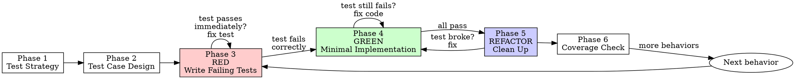

# Test First

> **Pillar**: Engineer | **ID**: `engineer-test-first`

## Purpose

Test-Driven Development enforcement. Write tests before implementation, use tests as specification, achieve meaningful coverage — not vanity metrics.

## Activation Triggers

- "write tests", "TDD", "test first", "unit test", "test coverage"
- "add test cases", "what should I test"
- Automatically chained before `feature-builder` when enforcement is `strict`

## Methodology

### Process Flow



### Phase 1 — Test Strategy
1. Identify what's being tested: function, class, API endpoint, workflow
2. Determine test type needed:
   - **Unit**: Isolated function/method behavior
   - **Integration**: Component interactions, API calls, DB queries
   - **E2E**: Full user journey (only when explicitly requested)
3. Follow existing test patterns in the project (framework, naming, file location)
4. Locate the test runner config and understand the test command

### Phase 2 — Test Case Design
For each function/component, design test cases across:

| Category | Examples |
|---|---|
| **Happy path** | Valid inputs producing expected outputs |
| **Edge cases** | Empty inputs, boundary values, single element, max size |
| **Error cases** | Invalid inputs, null/undefined, malformed data |
| **State transitions** | Before/after, concurrent access, cleanup |

Present as a test plan:
```
describe('{subject}')
  ✓ should {expected behavior} when {condition}
  ✓ should {expected behavior} when {edge case}
  ✗ should throw/return error when {invalid condition}
```

### Phase 3 — Red (Write Failing Tests)

<HARD-GATE>
Do NOT write any production/implementation code until failing tests exist.
If you find yourself writing implementation first, STOP, delete it, and write the test.
Tests MUST fail before any implementation begins. No exceptions.
</HARD-GATE>

1. Write the test cases with proper assertions
2. Use descriptive test names that read as specifications
3. Set up fixtures/mocks using the project's existing patterns
4. Run the tests — they MUST fail (red phase)
5. If tests pass immediately, they're not testing new behavior

### Phase 4 — Green (Minimal Implementation)
1. Write the minimum code to make tests pass
2. No optimization, no elegance — just make it work
3. Run tests — all must pass

### Phase 5 — Refactor
1. Clean up the implementation while tests stay green
2. Remove duplication
3. Improve naming
4. Extract helpers if needed
5. Run tests after each refactor step

### Phase 6 — Coverage Check
1. Run coverage tool
2. Check against `min_coverage` from config (default: 80%)
3. Identify uncovered branches — add tests only for meaningful gaps
4. Do NOT chase 100% — test behavior, not lines

## Tools Required

- `codebase` — Find existing test patterns, test config
- `findTestFiles` — Locate related test files
- `terminal` — Run tests, run coverage
- `crewpilot_metrics_coverage` — Get coverage report

## Output Format

```
## [CrewPilot → Test First]

### Test Strategy
- Type: {unit/integration/e2e}
- Framework: {detected framework}
- Test file: {path}

### Test Plan
{describe/it outline}

### Results
| Phase | Status |
|---|---|
| Red (failing tests) | {N} tests written, all fail ✓ |
| Green (passing) | All {N} pass ✓ |
| Refactor | Clean, tests still pass ✓ |
| Coverage | {%} (target: {min_coverage}%) |

### Tests Written
{list of test files created/modified}
```

## Chains To

- `feature-builder` — After tests are written, implement the feature
- `code-quality` — Review the implementation after TDD cycle
- `change-management` — Commit the TDD cycle

## Anti-Patterns

- Do NOT write tests after implementation and call it TDD
- Do NOT mock everything — test real behavior where feasible
- Do NOT write tests that test the framework instead of your code
- Do NOT skip the red phase — every test must fail first
- Do NOT chase coverage numbers with meaningless assertions

## Anti-Rationalizations

| Rationalization | Rebuttal |
|---|---|
| "Tests can come later, ship first" | Without failing tests first, you do not have a spec; you have a guess. Tests written after will assert whatever the code does, not what it should do. |
| "This is too simple to need tests" | Simple bugs ship to production. The test takes 30 seconds to write; the regression takes hours to investigate. |
| "I will write the test once I see the implementation" | That is characterization, not TDD. It locks in current behavior, not intended behavior. |
| "The framework is hard to mock here" | Test the seams you have. If everything requires mocking, the design is the problem, not the test. |
| "Coverage does not matter, I checked manually" | Manual checks do not run on every PR. Future regressions are silent without tests. |
| "Adding tests will delay the merge" | Tests are part of the change, not separate work. A PR without tests is incomplete, not faster. |

## Verification

**Evidence produced:**

- Test plan listing the cases (happy path, edge cases, error paths) before any implementation.
- Red-phase output: tests written and committed in a state where they fail with a meaningful failure message.
- Green-phase output: tests pass after implementation; runner output is captured.
- Refactor-phase diff (when applicable) showing implementation cleaned up while tests stayed green.
- Coverage report from `crewpilot_metrics_coverage` for the changed modules.

**Completion gates:**

- [ ] Red phase ran first; tests are recorded as failing before any implementation existed.
- [ ] Green phase verified; full test suite (not just new tests) is green.
- [ ] Coverage on the changed code is ≥ `min_coverage` from `crewpilot.config.json`.
- [ ] Tests assert behavior, not implementation details (no over-mocking).

**Blocking conditions:**

- Implementation was written before failing tests existed → restart from Red phase.
- Tests pass on first run without any implementation change → they are not exercising new behavior; rewrite.
- Coverage falls below threshold → cannot declare complete; add tests or escalate the threshold change.
