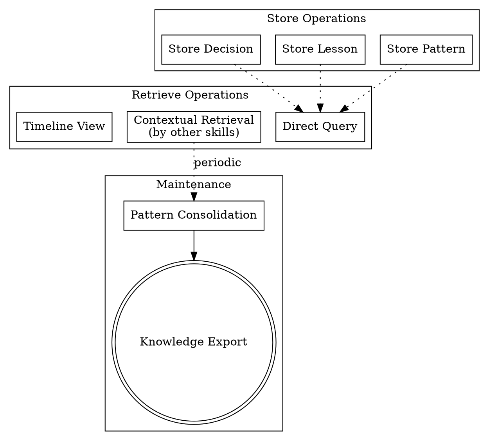

# Knowledge Base

> **Pillar**: Insights | **ID**: `insights-knowledge-base`

## Purpose

Persistent cross-session memory system. Stores decisions, patterns, lessons learned, and context so the team's knowledge compounds over time instead of resetting every conversation.

## Activation Triggers

- "remember this", "recall", "what did we decide about"
- "history", "past decisions", "context from last time"
- "save this insight", "knowledge base"
- Implicitly used by other skills to check for prior context

## Methodology

### Process Flow



### Store Operations

#### Store a Decision
When a significant decision is made during any skill:
1. Extract: decision, rationale, alternatives rejected, date, related files
2. Tag with categories: `architecture`, `technology`, `process`, `convention`
3. Store via `crewpilot_knowledge_store`

Entry format:
```json
{
  "type": "decision",
  "title": "{short title}",
  "content": "{decision and rationale}",
  "tags": ["{category}", "{technology}"],
  "related_files": ["{paths}"],
  "timestamp": "{ISO date}"
}
```

#### Store a Lesson Learned
When debugging reveals a non-obvious insight:
1. Extract: what happened, why, prevention measure
2. Tag with: `bug`, `performance`, `security`, `gotcha`
3. Link to the fix commit if available

#### Store a Pattern
When `pattern-detection` identifies a codebase convention:
1. Document the pattern with a code example
2. Tag with: `pattern`, `convention`, `style`
3. Reference canonical implementation files

#### Store a Meeting Reference
When a meeting produces decisions or requirements that influence code:
1. Extract: meeting subject, date, attendees, key decisions, action items, linked documents
2. Tag with: `meeting`, `decision`, `requirements`, and relevant feature/module tags
3. Link to the board items created from the meeting (if any)
4. Store via `crewpilot_knowledge_store`

Entry format:
```json
{
  "type": "meeting-reference",
  "title": "{meeting subject} — {date}",
  "content": "Decisions: {list}. Requirements: {list}. Action items: {list}.",
  "tags": ["meeting", "{feature}", "{module}"],
  "related_files": ["{board item URLs or issue numbers}"],
  "timestamp": "{ISO date}"
}
```

This creates a link between decisions and their source meetings — enabling other skills to trace why a requirement exists and who stated it. The `autopilot-meeting` skill should automatically store meeting references after creating board items.

### Retrieve Operations

#### Direct Query
User asks "what did we decide about X":
1. Search knowledge base via `crewpilot_knowledge_search`
2. Return matching entries with context
3. If multiple matches, rank by relevance and recency

#### Contextual Retrieval (by other skills)
Skills query the knowledge base before starting:
1. `solution-design` checks for prior decisions on the same topic
2. `architecture-planner` retrieves existing ADRs
3. `root-cause-analysis` checks if similar bugs were solved before
4. `code-quality` retrieves documented conventions

#### Timeline View
User asks "what happened this week/sprint":
1. Retrieve entries within the time range via `crewpilot_knowledge_timeline`
2. Group by type (decisions, lessons, patterns)
3. Present as a chronological narrative

### Maintenance Operations

#### Pattern Consolidation
Periodically:
1. Identify related entries that can be merged
2. Archive stale entries (decisions reversed, patterns abandoned)
3. Flag contradictory entries for resolution

#### Knowledge Export
Generate a summary document:
1. Active decisions and their current status
2. Team conventions with code examples
3. Common gotchas and their solutions

## Tools Required

- `crewpilot_knowledge_store` — Write entries to the knowledge base
- `crewpilot_knowledge_search` — Full-text search across entries
- `crewpilot_knowledge_timeline` — Time-range queries
- `crewpilot_knowledge_patterns` — Pattern frequency analysis
- `crewpilot_knowledge_export` — Generate summary documents

## Output Format

### For Storage
```
## [CrewPilot → Knowledge Base: Stored]

✓ Stored: {type} — "{title}"
Tags: {tags}
Related: {files}
```

### For Retrieval
```
## [CrewPilot → Knowledge Base: Retrieved]

### Results for "{query}"
Found {N} entries:

#### {title} ({type}, {date})
{content}
**Tags**: {tags}
**Related files**: {paths}

---
(repeat per entry)
```

### For Timeline
```
## [CrewPilot → Knowledge Base: Timeline]

### {date range}

**Decisions**
- {title}: {summary}

**Lessons Learned**
- {title}: {summary}

**Patterns**
- {title}: {summary}
```

## Chains To

- Any skill can chain TO knowledge-base to store findings
- Knowledge-base is queried BY other skills, but doesn't chain outward

## Anti-Patterns

- Do NOT store trivial information — only decisions, lessons, and patterns
- Do NOT store ephemeral state (what files are open, current branch)
- Do NOT return raw database entries — synthesize into readable summaries
- Do NOT store sensitive data (credentials, tokens, personal info)

## Verification

**Evidence produced:**

- Stored entry IDs with type (`decision` / `lesson` / `pattern` / `meeting-reference`), title, tags, related files, and ISO-8601 timestamp.
- For retrieval operations: results table with relevance scores from TF-IDF ranking.
- Consolidation report when related entries were merged.
- Sanitization log naming what was filtered before storage.

**Completion gates:**

- [ ] Every stored entry has all required fields (type, title, content, tags, related files, timestamp).
- [ ] No credentials, tokens, PII, or customer-identifying material in stored content.
- [ ] Duplicate-of-existing entries were consolidated, not appended.
- [ ] Retrieval results are synthesized into readable summaries, not raw rows.

**Blocking conditions:**

- Sensitive data detected in candidate entry → refuse to store; sanitize first.
- Trivial state (open files, current branch) requested for storage → refuse and explain.
- Entry duplicates an existing one within the last 30 days without new information → update the existing entry instead of creating a new one.
