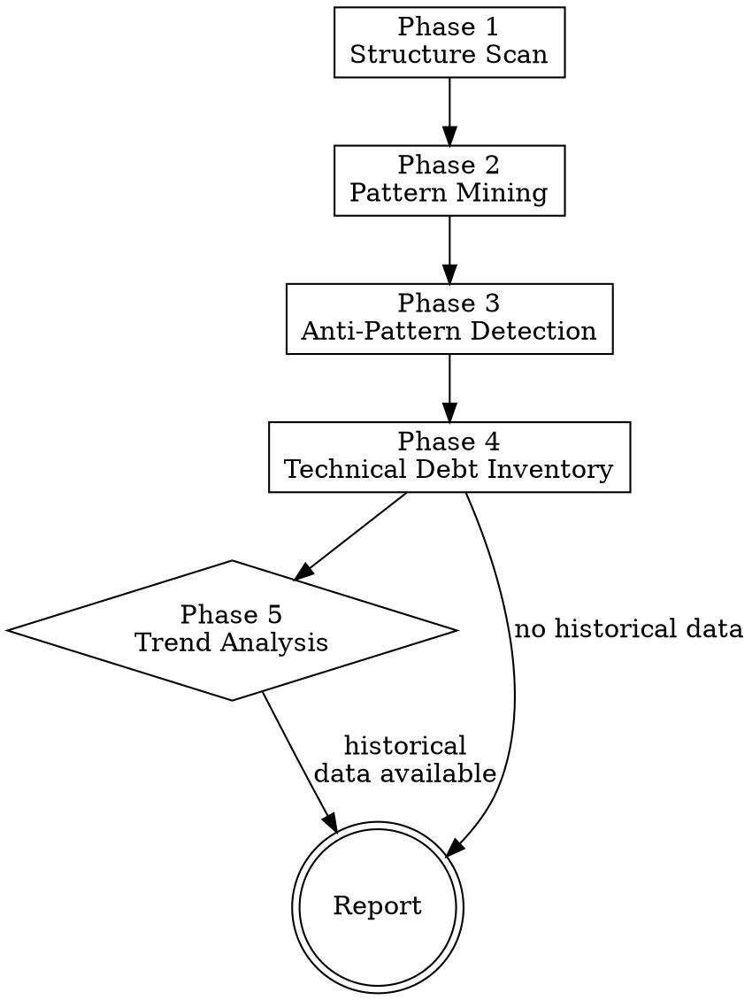

# Pattern Detection

> **Pillar**: Insights | **ID**: `insights-pattern-detection`

## Purpose

Codebase-wide pattern mining and anti-pattern identification. Analyzes structural health, detects recurring issues, tracks technical debt, and identifies emerging trends across the project.

## Activation Triggers

- "codebase health", "find patterns", "anti-patterns", "tech debt"
- "what patterns are we using", "code trends", "structural analysis"
- Automatically triggered when `root-cause-analysis` finds a systemic issue

## Methodology

### Process Flow



### Phase 1 — Structure Scan
1. Map the project structure: directories, modules, layers
2. Identify architectural patterns in use:
   - MVC, MVVM, Clean Architecture, Hexagonal
   - Microservices vs. monolith vs. modular monolith
   - API patterns: REST, GraphQL, RPC
3. Detect organizational patterns: feature-based vs. layer-based vs. hybrid

### Phase 2 — Pattern Mining
Scan for recurring code patterns:

| Category | Patterns to Detect |
|---|---|
| **Error handling** | Try-catch styles, error propagation, error types |
| **Data access** | ORM patterns, raw queries, repository pattern |
| **State management** | Global state, dependency injection, singletons |
| **API design** | Route organization, middleware chains, validation |
| **Testing** | Test structure, mock strategies, fixture patterns |
| **Configuration** | Env vars, config objects, feature flags |

For each pattern found:
- **Frequency**: How often it appears
- **Consistency**: Are there deviations from the pattern?
- **Quality**: Is this a good pattern for this context?

### Phase 3 — Anti-Pattern Detection
Flag known anti-patterns:

| Anti-Pattern | Symptoms |
|---|---|
| **God Object/File** | Single file > 500 lines with mixed responsibilities |
| **Circular Dependencies** | Module A imports B imports A |
| **Shotgun Surgery** | Small change requires touching 5+ files |
| **Feature Envy** | Function uses more of another module's data than its own |
| **Dead Code** | Unreachable functions, unused exports |
| **Copy-Paste** | Near-duplicate code blocks across files |
| **Primitive Obsession** | Strings/numbers used where domain types belong |
| **Configuration Drift** | Same setting configured differently in multiple places |

### Phase 4 — Technical Debt Inventory
For each anti-pattern or inconsistency:
1. Estimate effort to fix (T-shirt size)
2. Assess impact on team velocity
3. Rate urgency: address now vs. track vs. accept

### Phase 5 — Trend Analysis
If `crewpilot_knowledge_search` has historical data:
1. Compare current patterns vs. previous scans
2. Identify patterns that are spreading (good or bad)
3. Flag entropy increase — growing inconsistency over time

## Tools Required

- `codebase` — Full project scan
- `terminal` — Run static analysis tools
- `crewpilot_metrics_complexity` — Complexity metrics per module
- `crewpilot_knowledge_search` — Historical pattern data
- `crewpilot_knowledge_store` — Record findings for future comparison

## Output Format

```
## [CrewPilot → Pattern Detection]

### Architecture
{detected patterns and organization style}

### Code Patterns
| Pattern | Category | Frequency | Consistency | Quality |
|---|---|---|---|---|
| {pattern} | {category} | {count} | {high/medium/low} | {good/acceptable/poor} |

### Anti-Patterns
| Anti-Pattern | Locations | Severity | Fix Effort |
|---|---|---|---|
| {anti-pattern} | {files/modules} | {high/med/low} | {T-shirt} |

### Technical Debt
| Item | Impact | Urgency | Effort |
|---|---|---|---|
| {debt item} | {velocity/quality/security} | {now/track/accept} | {T-shirt} |

### Trends (if historical data available)
{getting better / getting worse / stable}

### Summary
Codebase health: {score}/10
Top concern: {most impactful issue}
Quick wins: {list of low-effort improvements}
```

## Chains To

- `code-quality` — Deep review of flagged anti-pattern locations
- `architecture-planner` — Restructure if systemic issues found
- `knowledge-base` — Store scan results for trend tracking

## Anti-Patterns (meta)

- Do NOT flag patterns as anti-patterns based on ideology — evaluate in context
- Do NOT report dead code without verifying it's truly unreachable
- Do NOT recommend rewrites for working code with manageable debt
- Do NOT present a massive list without prioritization

## Verification

**Evidence produced:**

- Pattern inventory grouped by category (error handling, data access, state management, API design, testing).
- Anti-pattern list with file:line citations for every flagged occurrence.
- Technical-debt summary prioritized by impact and remediation cost.
- Entropy delta versus the previous scan (when a baseline exists in the knowledge base).

**Completion gates:**

- [ ] Every flagged pattern or anti-pattern cites at least one concrete code location.
- [ ] Findings are prioritized; the report does not present an undifferentiated list.
- [ ] Dead-code claims were verified with reachability evidence (call graph, import graph, or test traces).
- [ ] Findings are stored in the knowledge base for trend analysis.

**Blocking conditions:**

- A finding has no code citation → drop it; speculation is not actionable.
- Ideology-based flag ("this should use functional style") with no project precedent → remove.
- Entropy delta cannot be computed because no baseline exists → establish a baseline scan first; do not invent a delta.
