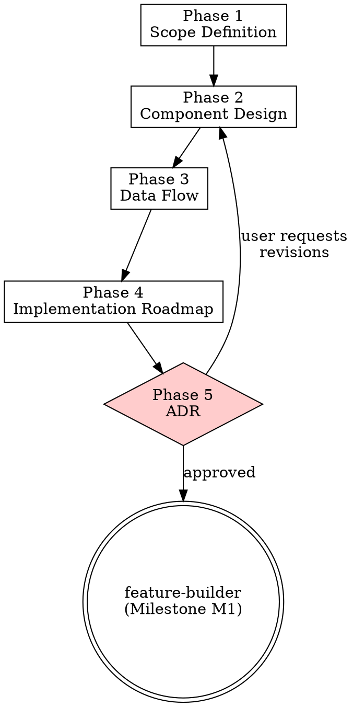

# Architecture Planner

> **Pillar**: Strategize | **ID**: `strategize-architecture-planner`

## Purpose

Transform decisions into concrete architecture plans with component diagrams, API contracts, data flow, and implementation roadmaps. Produces living design documents that evolve with the codebase.

## Activation Triggers

- "plan the architecture", "design the system", "create an RFC", "structure this"
- "how should I organize", "component diagram", "data flow", "API design"
- After `solution-design` selects an approach that needs detailing

## Methodology

### Process Flow



### Phase 1 — Scope Definition
1. Identify system boundaries — what's in scope vs. out of scope
2. List actors (users, services, external systems)
3. Define key quality attributes: scalability, latency, availability, consistency
4. Read existing codebase structure to understand current architecture

### Phase 2 — Component Design
1. Decompose into components/modules with clear responsibilities
2. Define interfaces between components (API contracts, event schemas)
3. Identify shared dependencies and data stores
4. Map to existing code structure where applicable

Output as a component table:

| Component | Responsibility | Inputs | Outputs | Dependencies |
|---|---|---|---|---|
| | | | | |

### Phase 3 — Data Flow
1. Trace the primary user journey through the system
2. Identify data transformations at each step
3. Mark synchronous vs. asynchronous boundaries
4. Identify potential bottlenecks and failure points

Produce a numbered flow:
```
1. User → API Gateway (HTTPS)
2. API Gateway → Auth Service (validate token)
3. Auth Service → User DB (query)
...
```

### Phase 4 — Implementation Roadmap
1. Break into milestones (each independently deployable/testable)
2. Order by dependency graph — foundations first
3. Estimate effort per milestone (T-shirt sizes)
4. Identify the critical path
5. Mark "go/no-go" decision points

### Phase 5 — ADR (Architecture Decision Record)

<HARD-GATE>
Do NOT begin implementation until the architecture plan (components, data flow, roadmap) has been presented to and approved by the user.
If the user has not explicitly confirmed the architecture, do NOT proceed.
</HARD-GATE>

If `require_adr` is true in config, generate:

```markdown
# ADR-{NNN}: {Title}

## Status: Proposed
## Context: {why this decision is needed}
## Decision: {what was decided}
## Consequences: {positive and negative}
## Alternatives Considered: {options rejected and why}
```

## Tools Required

- `codebase` — Analyze existing project structure and dependencies
- `terminal` — Run dependency analysis commands (package.json, imports, etc.)
- `crewpilot_knowledge_search` — Retrieve prior architecture decisions

## Output Format

```
## [CrewPilot → Architecture Planner]

### Scope
{boundaries, actors, quality attributes}

### Components
{component table}

### Data Flow
{numbered flow}

### Implementation Roadmap
| Milestone | Description | Effort | Dependencies |
|---|---|---|---|
| M1 | | | |

### Critical Path
{sequence}

### ADR (if enabled)
{ADR document}
```

## Chains To

- `feature-builder` — Start implementing milestone M1
- `test-first` — Write integration tests for component interfaces
- `doc-governance` — Ensure architecture docs stay synchronized

## Anti-Patterns

- Do NOT design in a vacuum — always scan the existing codebase first
- Do NOT create components with unclear responsibilities (god-service smell)
- Do NOT skip the roadmap — architecture without sequencing is just a diagram
- Do NOT ignore existing patterns — evolve, don't replace, unless explicitly asked

## Verification

**Evidence produced:**

- Component diagram naming every service, data store, and external dependency.
- Data-flow description (synchronous calls, async events, batch jobs) with trust boundaries.
- ADR draft (Context / Decision / Consequences) for each major decision.
- Implementation roadmap ordered by dependency, with milestones and exit criteria.
- Recorded user approval before downstream implementation can begin.

**Completion gates:**

- [ ] Every major decision has trade-offs named (not just the chosen path).
- [ ] Roadmap ordering reflects real dependencies, not author preference.
- [ ] Existing patterns are referenced; replacements are justified explicitly.
- [ ] User approval is captured in the artifact log.

**Blocking conditions:**

- User has not approved the architecture → downstream skills (`feature-builder`, `test-first`, `doc-governance`) MUST NOT begin.
- Diagram contradicts the data-flow description → cannot deliver; reconcile first.
- Replacement of an existing pattern proposed without justification → either justify or revert to evolution.
