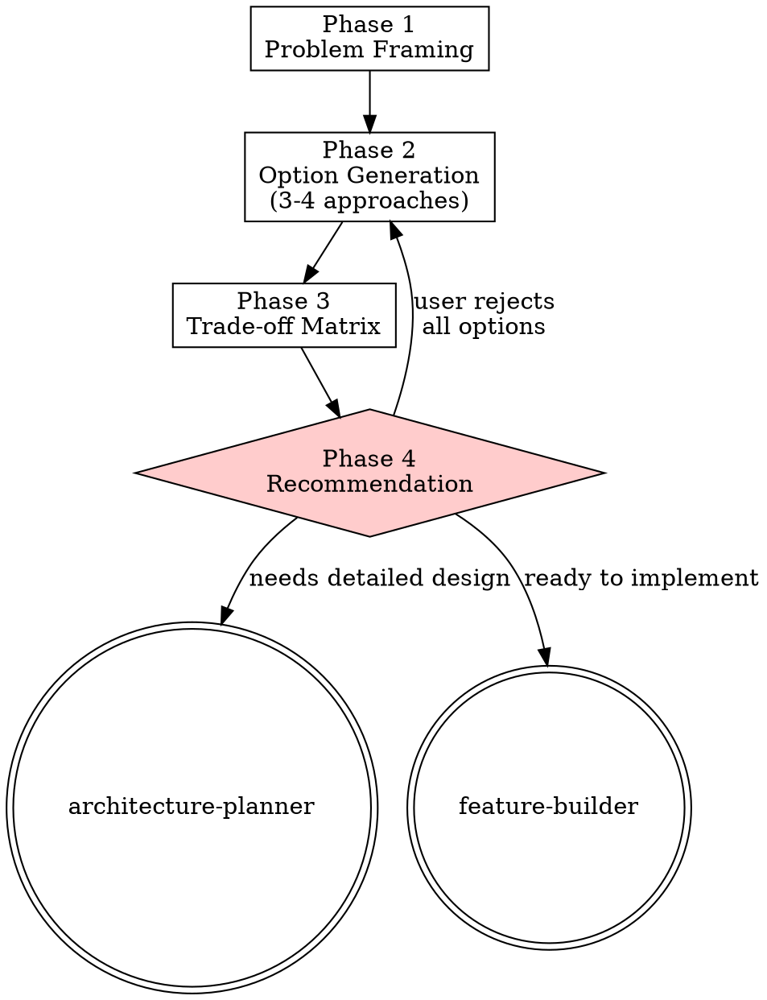

# Solution Design

> **Pillar**: Strategize | **ID**: `strategize-solution-design`

## Purpose

Structured ideation and trade-off analysis for technical decisions. Transforms vague questions into evaluated options with clear recommendations.

## Activation Triggers

- "brainstorm", "explore options", "what are the approaches", "tradeoffs", "should I use X or Y"
- Any open-ended technical question with multiple viable paths

## Methodology

### Process Flow



### Phase 1 — Problem Framing
1. Restate the problem in one sentence
2. Identify constraints: time, team size, existing tech stack, scale requirements
3. Ask 1-2 clarifying questions ONLY if the problem is genuinely ambiguous

### Phase 2 — Option Generation
1. Generate 3-4 distinct approaches (configurable via `max_options` in config)
2. Each option must include:
   - **Name**: Short memorable label
   - **Approach**: 2-3 sentence description
   - **Strengths**: What it does well
   - **Risks**: What could go wrong
   - **Effort**: T-shirt size (S/M/L/XL) with justification
3. Options must be genuinely different — not variations of the same approach

### Phase 3 — Trade-off Matrix
Build a comparison table:

| Criterion | Option A | Option B | Option C |
|---|---|---|---|
| Implementation effort | | | |
| Maintainability | | | |
| Performance | | | |
| Team familiarity | | | |

Rate each cell: `++` (strong), `+` (good), `~` (neutral), `-` (weak), `--` (poor)

### Phase 4 — Recommendation

<HARD-GATE>
Do NOT proceed to implementation or architecture planning until the user has reviewed the trade-off matrix and confirmed the recommended option.
Present the recommendation and wait for explicit approval or selection.
</HARD-GATE>

1. State the recommended option clearly
2. Provide confidence level (1-10) with reasoning
3. Identify the "decision reversal cost" — how hard is it to switch later
4. List 1-2 things to validate before committing

## Tools Required

- `codebase` — Scan existing stack for constraints
- `fetch` — Pull external docs/benchmarks when comparing technologies
- `crewpilot_knowledge_search` — Check if similar decisions were made before

## Output Format

```
## [CrewPilot → Solution Design]

### Problem
{one-sentence problem statement}

### Options
1. **{Name}** — {approach}
   - Strengths: ...
   - Risks: ...
   - Effort: {T-shirt}

### Trade-off Matrix
{table}

### Recommendation
**{Option Name}** (Confidence: {N}/10)
{reasoning}

**Reversal cost**: {Low/Medium/High}
**Validate first**: {list}
```

## Chains To

- `architecture-planner` — When the recommended option needs detailed design
- `feature-builder` — When the user wants to start implementing immediately

## Anti-Patterns

- Do NOT generate options just to fill a quota — 2 genuine options beat 4 padded ones
- Do NOT recommend without stating confidence and reversal cost
- Do NOT skip the trade-off matrix — it's the core value of this skill

## Verification

**Evidence produced:**

- Problem framing (the question we are answering, the constraints, the success criteria).
- Three to four candidate options, each with a one-paragraph description.
- Trade-off matrix covering at minimum: cost, risk, reversibility, complexity, time-to-value.
- Recommendation with explicit confidence (0-10) and reversal cost.
- Recorded user approval before downstream implementation can begin.

**Completion gates:**

- [ ] At least three substantive options were generated (no padding with strawmen).
- [ ] Trade-off matrix has every option scored on every dimension.
- [ ] Recommendation states confidence AND reversal cost, not just a verdict.
- [ ] User approval is captured in the artifact log.

**Blocking conditions:**

- User has not approved the recommendation → downstream skills (`architecture-planner`, `feature-builder`) MUST NOT begin.
- Confidence below project floor without escalation → surface the uncertainty; do not push a low-confidence recommendation through silently.
- Options are paddings of one core idea → regenerate; the trade-off matrix is meaningless without distinct options.
