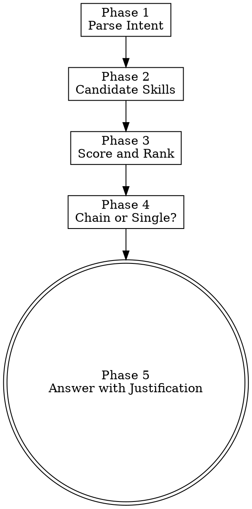

# Using CrewPilot

> **Pillar**: Meta | **ID**: `using-crewpilot`

## Purpose

Route an ambiguous, multi-intent, or under-specified request to the right CrewPilot skill (or chain of skills) and explain the choice. The agent calls this skill when the user's intent does not map cleanly onto a single trigger keyword, when multiple skills could plausibly handle the request, or when the user explicitly asks "what should we run?". Functions as a reasoning surface, not as a doer — it never executes the chosen skill, only selects and justifies.

## Activation Triggers

- "what should I do here", "which skill applies", "what do you recommend", "where do I start"
- The agent's trigger-keyword router matches two or more skills with similar confidence.
- The first user message in a session is genuinely ambiguous and the role-picker gate has already produced no confident inference.
- A complex request that crosses pillars (for example: "review this design then plan the rollout") needs an ordered chain rather than a single skill.
- The user asks meta-questions about CrewPilot itself: capabilities, available pillars, when to use which skill.

## Methodology

### Process Flow



### Phase 1 — Parse Intent

1. Decompose the user's request into one or more atomic intents. Each intent answers one verb-object pair (build X, review Y, ship Z).
2. Note explicit constraints: "use TDD", "behind a flag", "without changing the API", "before EOD".
3. Note explicit anti-constraints: "do not refactor", "do not touch the database", "no new dependencies".
4. Note role context: which of the seven role-picker roles (🔨 Build, 🔍 Review, 📋 Plan, 🏗️ Design, ✨ Simplify, 🚀 Ship, ⚡ Just-ask) the user is in. Skill availability differs per role.
5. If any intent is unparseable, emit a clarification request rather than guessing.

### Phase 2 — Candidate Skills

For each atomic intent, list every skill whose Activation Triggers section matches at least one keyword or scenario in the intent. Do not pre-filter on role here; role filtering happens in Phase 3.

Use the canonical inventory (see `Inputs` below) and group candidates by pillar:

- Strategize: solution-design, architecture-planner.
- Engineer: feature-builder, test-first, root-cause-analysis, code-simplification, doubt-driven-development, source-driven-development, incremental-implementation.
- Assure: code-quality, pr-intelligence, review-functional, review-standards, threat-model, vulnerability-scan.
- Deliver: change-management, doc-governance, deploy-guard, deprecation-migration.
- Insights: knowledge-base, pattern-detection.
- Autopilot: meeting, worker.
- Periodic: daily-digest.
- Meta: using-crewpilot (the skill calling this — never recurse).

### Phase 3 — Score and Rank

For each candidate skill, score:

| Dimension | Weight | Notes |
|-----------|--------|-------|
| Trigger match strength | high | How directly the user's wording maps to the Activation Triggers. |
| Role permission | hard gate | If the active role's matrix marks the skill ❌, eliminate. |
| Constraint satisfaction | high | Skills that conflict with explicit constraints are eliminated. |
| Evidence prerequisites | medium | Skills requiring artifacts the session does not have are deprioritized. |
| Pillar alignment | medium | Stay within the dominant pillar of the intent unless cross-pillar is explicit. |

Eliminate skills the active role cannot use. Sort the rest by total score descending. The top-1 is the recommendation; top-3 is the answer set.

### Phase 4 — Chain or Single

Decide whether one skill answers the request or a chain is required:

- **Single** when one skill's Output Format covers everything the user asked for.
- **Chain** when:
  - Two or more atomic intents are present (e.g., review + ship).
  - The top skill's `Chains To` section already names the next skill the user implied.
  - The user requested an end-to-end workflow that maps onto autopilot-worker or autopilot-meeting.

Construct chains by walking each skill's `Chains To` graph. Reject chains that loop or that include skills the role cannot use.

### Phase 5 — Answer with Justification

Produce the routing answer in the Output Format below. The answer:

- Names the chosen skill (or chain) with file paths.
- Cites the trigger phrase or scenario that drove the match.
- States which constraints shaped the choice.
- Lists the next-best alternative and why it lost.
- Does NOT execute the skill. Execution is the agent's job after the user confirms.

## Tools Required

- `crewpilot_session_get` — Read role context, prior artifacts, knowledge entries.
- `crewpilot_knowledge_query` — Look for prior `pattern` entries that solved similar requests.
- `crewpilot_artifact_write` — Persist the routing decision so subsequent turns can reuse it.

This skill performs no side effects beyond writing its own decision artifact. It does not modify code, board state, or external systems.

## Output Format

```markdown
## [CrewPilot → Using CrewPilot]

### Parsed Intent
- Atomic intents: [list]
- Constraints: [list, or "none stated"]
- Active role: [🔨 / 🔍 / 📋 / 🏗️ / ✨ / 🚀 / ⚡]

### Recommendation
- **Run**: `<skill-id>` ([SKILL.md](path)) — or chain: `A → B → C`
- **Why this skill**: [one sentence tying intent to Activation Triggers]
- **Constraints honored**: [list]

### Alternatives Considered
| Skill | Rejected because |
|-------|-------------------|
| `...` | role permission / constraint conflict / weaker trigger match |

### Confidence: {N}/10
### Next step: [agent action — e.g., "Invoke <skill> now" or "Confirm scope first"]
```

## Chains To

- Any other skill (this is the routing surface). Common follow-ups:
  - `autopilot-worker` — When the chain is full lifecycle.
  - `autopilot-meeting` — When the input is a meeting transcript.
  - `engineer-feature-builder` — Default for "build X".
  - `assure-pr-intelligence` — Default for "review this PR".
  - `strategize-solution-design` — Default for "design X" without architecture concerns.

## Inputs

- The user's verbatim request.
- The active role from the role picker.
- Session artifacts and the knowledge base (read-only).
- The CrewPilot skill inventory (the skills directory under `.github/skills/`).

## Anti-Patterns

- Do NOT execute the chosen skill. This skill recommends; the agent invokes.
- Do NOT recurse — never include `using-crewpilot` in a recommended chain.
- Do NOT route to a skill the active role cannot use; offer a role switch instead.
- Do NOT pad the recommendation with three skills when one is sufficient. Chains exist for multi-intent requests, not as a hedge.
- Do NOT fabricate skill names. Every recommendation links to an actual SKILL.md path.
- Do NOT recommend autopilot-worker for trivial single-skill requests; the role-picker exists to keep small tasks small.

## Verification

**Evidence produced:**

- Routing decision artifact under `.crewpilot/routing/<timestamp>-decision.md` containing parsed intent, recommendation, alternatives, and confidence.
- Citation in the recommendation pointing to the trigger phrase or scenario in the chosen skill's Activation Triggers section.

**Completion gates:**

- [ ] Every atomic intent in the user's request is addressed by either the recommendation or an explicit "deferred / out of scope" note.
- [ ] The recommendation respects the active role's permissions matrix.
- [ ] At least one alternative is named with the reason for rejection.
- [ ] The chosen skill's SKILL.md path exists in the workspace.
- [ ] Confidence score is present and below 10/10 unless the trigger match is verbatim.

**Blocking conditions:**

- The user's request cannot be parsed into at least one atomic intent → return a clarifying question instead of a routing answer.
- No skill matches any intent → return "no skill in CrewPilot covers this; use a generic agent" rather than forcing a poor match.
- The top candidate is forbidden by the active role and the role cannot be switched → halt with a role-switch suggestion.
- The recommendation includes `using-crewpilot` itself → reject; redo Phase 4.
