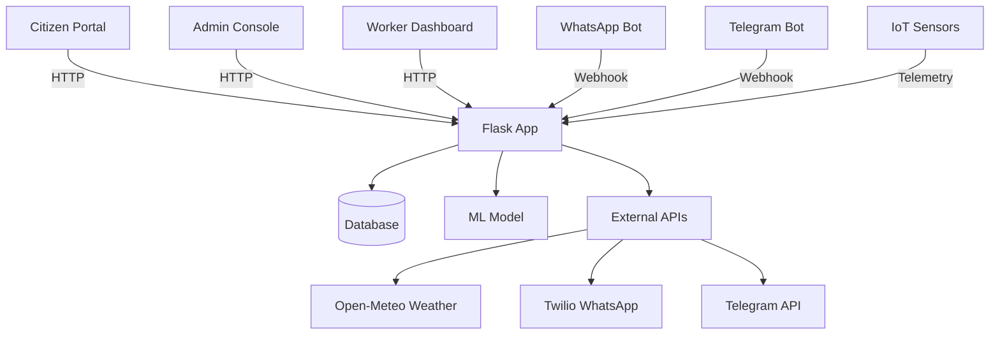
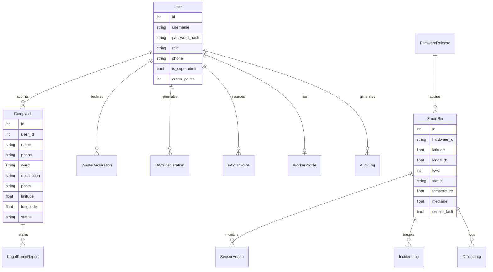

# SmartGarbage — System Architecture

## 📐 System Diagram

## 🗄️ Data Model (ER Diagram)

## 🔄 Request Flow Walkthroughs

### Complaint Submission Flow

1. Citizen opens dashboard (`/dashboard`)
2. Fills Emergency Cleanup form with GPS, photo, description
3. POST to `/report` with CSRF token
4. Server validates, stores complaint, awards Green Points
5. Redirects to success page

### WhatsApp Illegal-Dump Reporting

1. Citizen sends photo via WhatsApp to Twilio number
2. Twilio webhook POSTs to `/webhook/whatsapp`
3. Server downloads media, extracts GPS, creates `IllegalDumpReport`
4. Replies with TwiML acknowledgment

### IoT Telemetry Processing

1. Smart bin sends telemetry to IoT endpoint
2. Server evaluates emergency metrics (temp > 65°C or methane > 500ppm)
3. Creates `IncidentLog` if threshold exceeded
4. Triggers webhook notifications to registered endpoints

### Admin MFA Login

1. Admin submits credentials at `/login`
2. Server verifies password, generates OTP, stores with 5-min expiry
3. Redirects to `/mfa-verify` with OTP display (simulated SMS)
4. Admin enters OTP, server validates, grants access

## 🔒 Security Architecture

| Measure | Implementation | Why |
|---------|---------------|-----|
| **Admin registration blocked** | Role validation in `register()` | Prevents privilege escalation |
| **MFA for privileged roles** | OTP required for admin/worker | Multi-factor authentication |
| **SECRET_KEY env var** | Read from environment with fallback | Avoids hardcoded secrets |
| **File upload uniqueness** | Random prefix on filenames | Prevents collision attacks |
| **Phone validation** | `validate_indian_phone()` helper | Rejects fake/sequential numbers |
| **Rate limiting** | Flask-Limiter on auth routes | Prevents brute-force attacks |
| **Debug mode gated** | FLASK_ENV check in run.py | Prevents info disclosure |

## 📊 API Reference

### Citizen Endpoints

| Method | Route | Auth | Description |
|--------|-------|------|-------------|
| GET | `/dashboard` | Login | Citizen dashboard |
| POST | `/report` | Login | Submit complaint |
| POST | `/dashboard/declare-waste` | Login | Declare segregation |
| GET | `/api/payt-invoice` | Login | Get PAYT invoices |

### Admin Endpoints

| Method | Route | Auth | Description |
|--------|-------|------|-------------|
| GET | `/admin` | Admin | Admin console |
| GET | `/admin/audit` | Admin | Audit trail |
| POST | `/admin/firmware/upload` | Admin | Upload firmware |
| GET | `/api/route-optimize` | Admin | Optimize routes |

### Public/Webhook Endpoints

| Method | Route | Auth | Description |
|--------|-------|------|-------------|
| POST | `/webhook/whatsapp` | None | WhatsApp reporting |
| POST | `/webhook/telegram` | None | Telegram reporting |
| GET | `/report-illegal` | None | Anonymous reporting |

## 🎯 Known Gaps

1. **No automated tests** — pytest coverage needed for auth, complaints, admin actions
2. **Segregation penalty not wired into billing** — PAYT invoice should use compliance score
3. **Single-worker rate limiting** — global limits, not per-user
4. **No CI/CD pipeline** — GitHub Actions for tests/linting
5. **Informal worker safety tracking** — PPE/insurance fields needed in `WorkerProfile`

## 🚀 Future Roadmap

- [ ] Segregation compliance multiplier in PAYT billing
- [ ] Worker safety/insurance tracking
- [ ] State portal compliance export
- [ ] Citizen segregation streak/score
- [ ] Trend analytics dashboard
- [ ] Mobile app (PWA enhancement)